Analyses for **Shared worlds and shared consequences: Initial validation
of the Assessment of Parent and Child Adversity (APCA)** (King et al.,
2021)
================
Lucy S. King
5/14/2021

  - [Environment](#environment)
  - [Read in data](#read-in-data)
  - [Sample descriptives](#sample-descriptives)
      - [Missing data](#missing-data)
      - [Internal consistency of
        measures](#internal-consistency-of-measures)
      - [Continuous variables](#continuous-variables)
      - [Categorical variables](#categorical-variables)
      - [Correlations](#correlations)
      - [t-tests](#t-tests)
      - [Additional APCA descriptives](#additional-apca-descriptives)
  - [Primary statistical analyses](#primary-statistical-analyses)
      - [Convergent validity](#convergent-validity)
      - [Discriminant validity](#discriminant-validity)
      - [Concurrent validity](#concurrent-validity)
      - [Comparative convergent
        validity](#comparative-convergent-validity)

# Environment

``` r
library(tidyverse)
```

    ## ── Attaching packages ─────────────────────────────────────── tidyverse 1.3.0 ──

    ## ✓ ggplot2 3.3.3     ✓ purrr   0.3.4
    ## ✓ tibble  3.1.2     ✓ dplyr   1.0.4
    ## ✓ tidyr   1.1.2     ✓ stringr 1.4.0
    ## ✓ readr   1.4.0     ✓ forcats 0.5.1

    ## ── Conflicts ────────────────────────────────────────── tidyverse_conflicts() ──
    ## x dplyr::filter() masks stats::filter()
    ## x dplyr::lag()    masks stats::lag()

``` r
library(corrr)
library(performance)
library(parameters)
library(effectsize)
library(boot)
library(pscl)
```

    ## Classes and Methods for R developed in the
    ## Political Science Computational Laboratory
    ## Department of Political Science
    ## Stanford University
    ## Simon Jackman
    ## hurdle and zeroinfl functions by Achim Zeileis

``` r
library(ggpubr)
library(see)
library(msm)
```

    ## 
    ## Attaching package: 'msm'

    ## The following object is masked from 'package:boot':
    ## 
    ##     cav

``` r
library(facetscales)
library(DescTools)
library(gridExtra)
```

    ## 
    ## Attaching package: 'gridExtra'

    ## The following object is masked from 'package:dplyr':
    ## 
    ##     combine

``` r
library(MASS)
```

    ## 
    ## Attaching package: 'MASS'

    ## The following object is masked from 'package:dplyr':
    ## 
    ##     select

``` r
library(BayesFactor)
```

    ## Loading required package: coda

    ## Loading required package: Matrix

    ## 
    ## Attaching package: 'Matrix'

    ## The following objects are masked from 'package:tidyr':
    ## 
    ##     expand, pack, unpack

    ## ************
    ## Welcome to BayesFactor 0.9.12-4.2. If you have questions, please contact Richard Morey (richarddmorey@gmail.com).
    ## 
    ## Type BFManual() to open the manual.
    ## ************

``` r
library(bayestestR)
```

    ## Note: The default CI width (currently `ci=0.89`) might change in future versions (see https://github.com/easystats/bayestestR/discussions/250). To prevent any issues, please set it explicitly when using bayestestR functions, via the 'ci' argument.

``` r
home <- "~/Box/Mooddata_Coordinating/MOD/Data/REDCap/"
demo_file <- paste0(home, "demographics/demo_cleaned_20210512.csv")
apca_file <- paste0(home, "APCA/apca_scored_20210514.csv")
cesd_file <- paste0(home, "CESD/cesd_scored_20210512.csv")
bai_file <- paste0(home, "BAI/bai_scored_20210512.csv")
cbcl_file <- paste0(home, "CBCL/preschool/cbcl_preschool_cleaned_20210423.csv")
ctq_file <- paste0(home, "CTQ/ctq_scored_20210512.csv")
bces_file <- paste0(home, "BCES/bces_scored_20210512.csv")
mod_bl_stress_file <- paste0(home, "MoD_Pregnancy_Project/baseline_stress_life_events.csv")

source("winsorize.r")

theme_mod <-
  theme_pubr() +
  theme(
    panel.grid = element_blank(),
    plot.title = element_text(size = 18, hjust = .5, face = "bold"),
    axis.title = element_text(size = 20),
    axis.text = element_text(size = 18),
    legend.title = element_text(size = 20), 
    legend.text = element_text(size = 18),
    strip.text = element_text(size = 16, face = "bold"),
    strip.background = element_blank(),
    legend.position = "bottom"
  )

options(scipen = 999)
```

# Read in data

``` r
d <-
  read_csv(demo_file) %>% 
  left_join(read_csv(apca_file), by = "id") %>% 
  left_join(read_csv(cesd_file), by = "id") %>% 
  left_join(read_csv(bai_file), by = "id") %>% 
  left_join(
    read_csv(cbcl_file) %>% 
      distinct(id, .keep_all = TRUE), 
    by = "id"
  ) %>% 
  left_join(read_csv(ctq_file), by = "id") %>% 
  left_join(read_csv(bces_file), by = "id") %>% 
  left_join(read_csv(mod_bl_stress_file), by = "id") 
```

    ## 
    ## ── Column specification ────────────────────────────────────────────────────────
    ## cols(
    ##   .default = col_character(),
    ##   id = col_double(),
    ##   timestamp = col_date(format = ""),
    ##   mom_latinx = col_double(),
    ##   mom_poc = col_double(),
    ##   mom_anative = col_double(),
    ##   mom_asian = col_double(),
    ##   mom_black = col_double(),
    ##   mom_pnative = col_double(),
    ##   mom_white = col_double(),
    ##   mom_other_race = col_double(),
    ##   mom_decline_race = col_double(),
    ##   employment_explain = col_logical(),
    ##   marital_status_describe = col_logical(),
    ##   ppl_in_home_schoolage = col_double(),
    ##   ppl_in_home_adults = col_double(),
    ##   ppl_in_home_allchild = col_double(),
    ##   current_num_children = col_double(),
    ##   num_children_bio = col_double(),
    ##   child_anative = col_double(),
    ##   child_asian = col_double()
    ##   # ... with 19 more columns
    ## )
    ## ℹ Use `spec()` for the full column specifications.

    ## 
    ## ── Column specification ────────────────────────────────────────────────────────
    ## cols(
    ##   .default = col_double(),
    ##   redcap_event_name = col_character(),
    ##   redcap_survey_identifier = col_logical(),
    ##   apca_timestamp = col_character(),
    ##   other1_desc = col_character(),
    ##   other1_child_age_wit = col_logical(),
    ##   other1_child_age_wit_unit = col_logical(),
    ##   other1_child_exp_wit = col_logical(),
    ##   other1_child_sev_wit = col_logical(),
    ##   other2_desc = col_character(),
    ##   jail_child_age_wit = col_logical(),
    ##   jail_child_age_wit_unit = col_logical(),
    ##   jail_child_exp_wit = col_logical(),
    ##   jail_child_sev_wit = col_logical(),
    ##   police_child_age_wit = col_logical(),
    ##   police_child_age_wit_unit = col_logical(),
    ##   police_child_exp_wit = col_logical(),
    ##   police_child_sev_wit = col_logical(),
    ##   adopt_age_offset = col_logical(),
    ##   sep_age_offset = col_logical(),
    ##   famviol_child_age_wit = col_logical()
    ##   # ... with 26 more columns
    ## )
    ## ℹ Use `spec()` for the full column specifications.

    ## 
    ## ── Column specification ────────────────────────────────────────────────────────
    ## cols(
    ##   .default = col_double(),
    ##   redcap_event_name = col_character(),
    ##   cesd_timestamp = col_datetime(format = "")
    ## )
    ## ℹ Use `spec()` for the full column specifications.

    ## 
    ## ── Column specification ────────────────────────────────────────────────────────
    ## cols(
    ##   .default = col_double(),
    ##   bai_timestamp = col_datetime(format = "")
    ## )
    ## ℹ Use `spec()` for the full column specifications.

    ## 
    ## ── Column specification ────────────────────────────────────────────────────────
    ## cols(
    ##   .default = col_double(),
    ##   date = col_character(),
    ##   vocabulary_score_for_30_35_months_tscore = col_logical()
    ## )
    ## ℹ Use `spec()` for the full column specifications.

    ## 
    ## ── Column specification ────────────────────────────────────────────────────────
    ## cols(
    ##   .default = col_double(),
    ##   ctq_timestamp = col_datetime(format = "")
    ## )
    ## ℹ Use `spec()` for the full column specifications.

    ## 
    ## ── Column specification ────────────────────────────────────────────────────────
    ## cols(
    ##   id = col_double(),
    ##   bces_timestamp = col_datetime(format = ""),
    ##   bce_1 = col_double(),
    ##   bce_2 = col_double(),
    ##   bce_3 = col_double(),
    ##   bce_4 = col_double(),
    ##   bce_5 = col_double(),
    ##   bce_6 = col_double(),
    ##   bce_7 = col_double(),
    ##   bce_8 = col_double(),
    ##   bce_9 = col_double(),
    ##   bce_10 = col_double(),
    ##   bces_total = col_double()
    ## )

    ## 
    ## ── Column specification ────────────────────────────────────────────────────────
    ## cols(
    ##   id = col_double(),
    ##   stress_death_lovd1 = col_double(),
    ##   stress_accident = col_double(),
    ##   stress_bully = col_double(),
    ##   stress_divorce_parent = col_double(),
    ##   stress_divorce_self = col_double(),
    ##   stress_home_loss_parent = col_double(),
    ##   stress_home_loss_self = col_double(),
    ##   stress_job_loss_parent = col_double(),
    ##   stress_job_loss_self = col_double(),
    ##   stress_major_illness = col_double(),
    ##   stress_other_experience1 = col_double(),
    ##   stress_other_experience2 = col_double()
    ## )

``` r
df <-
  d %>% 
  filter(!is.na(apca_timestamp)) %>% 
  mutate(
    primary_english = if_else(
      primarylang == "English", 1, 0
    )
  )
```

``` r
df <-
  df %>% 
  group_by(id) %>% 
  # calculate total from life events checklist collected during pregnancy
  mutate(
    prenatal_life_events = sum(
      c(
        stress_death_lovd1,
        stress_accident,
        stress_bully,
        stress_divorce_parent,
        stress_divorce_self,
        stress_home_loss_parent,
        stress_home_loss_self,
        stress_job_loss_parent,
        stress_job_loss_self,
        stress_major_illness,
        stress_other_experience1,
        stress_other_experience2
      ),
      na.rm = TRUE
    ),
    prenatal_life_events = if_else(
      is.na(stress_death_lovd1), NA_real_, prenatal_life_events
    )
  ) %>% 
  ungroup()
```

# Sample descriptives

## Missing data

``` r
df %>% 
  count(!is.na(ctq_total))
```

    ## # A tibble: 2 x 2
    ##   `!is.na(ctq_total)`     n
    ## * <lgl>               <int>
    ## 1 FALSE                   1
    ## 2 TRUE                   96

``` r
df %>% 
  count(!is.na(bces_total))
```

    ## # A tibble: 2 x 2
    ##   `!is.na(bces_total)`     n
    ## * <lgl>                <int>
    ## 1 FALSE                    1
    ## 2 TRUE                    96

``` r
df %>% 
  count(!is.na(cesd_total))
```

    ## # A tibble: 2 x 2
    ##   `!is.na(cesd_total)`     n
    ## * <lgl>                <int>
    ## 1 FALSE                    1
    ## 2 TRUE                    96

``` r
df %>% 
  count(!is.na(bai_total))
```

    ## # A tibble: 2 x 2
    ##   `!is.na(bai_total)`     n
    ## * <lgl>               <int>
    ## 1 FALSE                   1
    ## 2 TRUE                   96

``` r
df %>% 
  count(!is.na(total_problems_total))
```

    ## # A tibble: 2 x 2
    ##   `!is.na(total_problems_total)`     n
    ## * <lgl>                          <int>
    ## 1 FALSE                              1
    ## 2 TRUE                              96

``` r
df %>% 
  count(!is.na(prenatal_life_events))
```

    ## # A tibble: 2 x 2
    ##   `!is.na(prenatal_life_events)`     n
    ## * <lgl>                          <int>
    ## 1 FALSE                             16
    ## 2 TRUE                              81

``` r
df %>% 
  count(!is.na(prenatal_life_events))
```

    ## # A tibble: 2 x 2
    ##   `!is.na(prenatal_life_events)`     n
    ## * <lgl>                          <int>
    ## 1 FALSE                             16
    ## 2 TRUE                              81

## Internal consistency of measures

``` r
# CTQ-SF
df %>% 
  dplyr::select(ctq_1:ctq_25) %>% 
  psych::alpha()
```

    ## 
    ## Reliability analysis   
    ## Call: psych::alpha(x = .)
    ## 
    ##   raw_alpha std.alpha G6(smc) average_r S/N    ase mean   sd median_r
    ##       0.95      0.95    0.99      0.45  20 0.0059  0.3 0.57     0.49
    ## 
    ##  lower alpha upper     95% confidence boundaries
    ## 0.94 0.95 0.96 
    ## 
    ##  Reliability if an item is dropped:
    ##        raw_alpha std.alpha G6(smc) average_r S/N alpha se var.r med.r
    ## ctq_1       0.95      0.95    0.99      0.45  19   0.0063 0.064  0.48
    ## ctq_2       0.95      0.95    0.99      0.44  19   0.0063 0.061  0.47
    ## ctq_3       0.95      0.95    0.99      0.45  20   0.0062 0.064  0.49
    ## ctq_4       0.95      0.95    0.99      0.46  20   0.0059 0.062  0.49
    ## ctq_5       0.95      0.95    0.99      0.45  19   0.0062 0.063  0.48
    ## ctq_6       0.95      0.95    0.99      0.46  21   0.0060 0.063  0.50
    ## ctq_7       0.95      0.95    0.99      0.45  19   0.0063 0.062  0.48
    ## ctq_8       0.95      0.95    0.99      0.44  19   0.0064 0.062  0.48
    ## ctq_9       0.95      0.95    0.99      0.44  19   0.0065 0.061  0.47
    ## ctq_10      0.95      0.95    0.99      0.45  19   0.0063 0.061  0.47
    ## ctq_11      0.95      0.95    0.99      0.44  19   0.0061 0.061  0.48
    ## ctq_12      0.95      0.95    0.99      0.46  20   0.0060 0.061  0.49
    ## ctq_13      0.95      0.95    0.99      0.44  19   0.0062 0.061  0.48
    ## ctq_14      0.95      0.95    0.99      0.45  19   0.0060 0.061  0.49
    ## ctq_15      0.95      0.95    0.99      0.44  19   0.0061 0.060  0.49
    ## ctq_16      0.95      0.95    0.99      0.44  19   0.0065 0.062  0.47
    ## ctq_17      0.95      0.95    0.99      0.44  19   0.0065 0.062  0.47
    ## ctq_18      0.95      0.95    0.99      0.44  19   0.0063 0.062  0.47
    ## ctq_19      0.95      0.95    0.99      0.44  19   0.0063 0.064  0.48
    ## ctq_20      0.95      0.95    0.99      0.44  19   0.0064 0.063  0.48
    ## ctq_21      0.95      0.95    0.99      0.44  19   0.0062 0.060  0.48
    ## ctq_22      0.95      0.95    0.99      0.44  19   0.0063 0.062  0.47
    ## ctq_23      0.95      0.96    0.99      0.48  22   0.0057 0.052  0.51
    ## ctq_24      0.95      0.96    0.99      0.48  22   0.0059 0.053  0.51
    ## ctq_25      0.95      0.95    0.99      0.46  20   0.0060 0.063  0.50
    ## 
    ##  Item statistics 
    ##         n raw.r std.r r.cor r.drop  mean   sd
    ## ctq_1  95  0.77  0.74  0.73   0.73 0.589 1.15
    ## ctq_2  95  0.81  0.80  0.80   0.80 0.147 0.60
    ## ctq_3  94  0.67  0.65  0.64   0.65 0.277 0.69
    ## ctq_4  96  0.62  0.57  0.56   0.57 0.688 1.10
    ## ctq_5  95  0.76  0.72  0.72   0.73 0.526 1.18
    ## ctq_6  94  0.44  0.49  0.47   0.42 0.074 0.34
    ## ctq_7  94  0.75  0.72  0.72   0.73 0.351 0.95
    ## ctq_8  96  0.80  0.76  0.76   0.77 0.427 1.07
    ## ctq_9  96  0.85  0.82  0.82   0.82 0.344 0.98
    ## ctq_10 95  0.79  0.75  0.75   0.77 0.253 0.85
    ## ctq_11 96  0.71  0.75  0.75   0.67 0.240 0.83
    ## ctq_12 96  0.42  0.51  0.50   0.41 0.010 0.10
    ## ctq_13 96  0.76  0.81  0.82   0.74 0.167 0.78
    ## ctq_14 96  0.67  0.73  0.73   0.64 0.188 0.79
    ## ctq_15 95  0.71  0.77  0.77   0.68 0.158 0.78
    ## ctq_16 96  0.88  0.87  0.87   0.86 0.333 0.83
    ## ctq_17 96  0.86  0.87  0.87   0.84 0.385 0.97
    ## ctq_18 96  0.81  0.82  0.82   0.79 0.198 0.66
    ## ctq_19 96  0.80  0.77  0.77   0.76 0.698 1.27
    ## ctq_20 95  0.82  0.79  0.79   0.79 0.747 1.34
    ## ctq_21 96  0.75  0.79  0.79   0.73 0.115 0.61
    ## ctq_22 96  0.81  0.82  0.82   0.79 0.198 0.66
    ## ctq_23 96  0.16  0.16  0.13   0.11 0.260 0.68
    ## ctq_24 96  0.16  0.18  0.16   0.14 0.052 0.34
    ## ctq_25 96  0.43  0.50  0.49   0.41 0.062 0.28
    ## 
    ## Non missing response frequency for each item
    ##           0    1    2    3    5 miss
    ## ctq_1  0.71 0.15 0.06 0.05 0.03 0.02
    ## ctq_2  0.91 0.07 0.01 0.00 0.01 0.02
    ## ctq_3  0.84 0.06 0.07 0.02 0.00 0.03
    ## ctq_4  0.67 0.08 0.17 0.07 0.01 0.01
    ## ctq_5  0.80 0.02 0.09 0.05 0.03 0.02
    ## ctq_6  0.95 0.03 0.02 0.00 0.00 0.03
    ## ctq_7  0.84 0.04 0.09 0.01 0.02 0.03
    ## ctq_8  0.80 0.09 0.04 0.03 0.03 0.01
    ## ctq_9  0.85 0.05 0.03 0.04 0.02 0.01
    ## ctq_10 0.88 0.04 0.05 0.00 0.02 0.02
    ## ctq_11 0.89 0.05 0.04 0.00 0.02 0.01
    ## ctq_12 0.99 0.01 0.00 0.00 0.00 0.01
    ## ctq_13 0.94 0.02 0.02 0.00 0.02 0.01
    ## ctq_14 0.92 0.04 0.02 0.00 0.02 0.01
    ## ctq_15 0.95 0.01 0.02 0.00 0.02 0.02
    ## ctq_16 0.81 0.09 0.06 0.02 0.01 0.01
    ## ctq_17 0.80 0.10 0.04 0.03 0.02 0.01
    ## ctq_18 0.88 0.08 0.03 0.00 0.01 0.01
    ## ctq_19 0.69 0.11 0.09 0.06 0.04 0.01
    ## ctq_20 0.66 0.15 0.07 0.06 0.05 0.02
    ## ctq_21 0.95 0.03 0.00 0.01 0.01 0.01
    ## ctq_22 0.88 0.08 0.03 0.00 0.01 0.01
    ## ctq_23 0.84 0.08 0.04 0.03 0.00 0.01
    ## ctq_24 0.97 0.02 0.00 0.01 0.00 0.01
    ## ctq_25 0.95 0.04 0.01 0.00 0.00 0.01

``` r
# BCES
df %>% 
  dplyr::select(bce_1:bce_10) %>% 
  psych::alpha()
```

    ## Warning in psych::alpha(.): Item = bce_2 had no variance and was deleted but
    ## still is counted in the score

    ## 
    ## Reliability analysis   
    ## Call: psych::alpha(x = .)
    ## 
    ##   raw_alpha std.alpha G6(smc) average_r S/N  ase mean   sd median_r
    ##       0.64      0.64     0.7      0.17 1.8 0.05 0.94 0.11     0.16
    ## 
    ##  lower alpha upper     95% confidence boundaries
    ## 0.54 0.64 0.74 
    ## 
    ##  Reliability if an item is dropped:
    ##        raw_alpha std.alpha G6(smc) average_r S/N alpha se var.r med.r
    ## bce_1       0.64      0.64    0.69      0.18 1.8    0.050 0.033  0.18
    ## bce_3       0.66      0.65    0.70      0.19 1.8    0.045 0.035  0.21
    ## bce_4       0.62      0.63    0.68      0.18 1.7    0.053 0.033  0.16
    ## bce_5       0.64      0.67    0.71      0.20 2.0    0.051 0.032  0.22
    ## bce_6       0.60      0.62    0.65      0.17 1.6    0.057 0.027  0.16
    ## bce_7       0.54      0.57    0.64      0.14 1.3    0.067 0.032  0.10
    ## bce_8       0.62      0.61    0.66      0.16 1.6    0.054 0.030  0.16
    ## bce_9       0.55      0.57    0.63      0.14 1.3    0.065 0.031  0.16
    ## bce_10      0.60      0.58    0.63      0.15 1.4    0.056 0.029  0.15
    ## 
    ##  Item statistics 
    ##         n raw.r std.r r.cor r.drop mean   sd
    ## bce_1  96  0.35  0.42  0.30   0.18 0.96 0.20
    ## bce_3  96  0.42  0.39  0.24   0.17 0.90 0.31
    ## bce_4  96  0.47  0.45  0.33   0.28 0.94 0.24
    ## bce_5  96  0.25  0.31  0.14   0.12 0.98 0.14
    ## bce_6  96  0.54  0.50  0.45   0.38 0.95 0.22
    ## bce_7  96  0.74  0.67  0.64   0.54 0.86 0.34
    ## bce_8  96  0.44  0.53  0.47   0.33 0.98 0.14
    ## bce_9  96  0.72  0.68  0.65   0.51 0.85 0.35
    ## bce_10 96  0.57  0.65  0.62   0.48 0.98 0.14
    ## 
    ## Non missing response frequency for each item
    ##           0    1 miss
    ## bce_1  0.04 0.96 0.01
    ## bce_3  0.10 0.90 0.01
    ## bce_4  0.06 0.94 0.01
    ## bce_5  0.02 0.98 0.01
    ## bce_6  0.05 0.95 0.01
    ## bce_7  0.14 0.86 0.01
    ## bce_8  0.02 0.98 0.01
    ## bce_9  0.15 0.85 0.01
    ## bce_10 0.02 0.98 0.01

``` r
# CESD
df %>% 
  dplyr::select(cesd_1:cesd_20) %>% 
  psych::alpha()
```

    ## 
    ## Reliability analysis   
    ## Call: psych::alpha(x = .)
    ## 
    ##   raw_alpha std.alpha G6(smc) average_r S/N   ase mean   sd median_r
    ##       0.85      0.87    0.91      0.25 6.5 0.022 0.48 0.34     0.23
    ## 
    ##  lower alpha upper     95% confidence boundaries
    ## 0.8 0.85 0.89 
    ## 
    ##  Reliability if an item is dropped:
    ##         raw_alpha std.alpha G6(smc) average_r S/N alpha se var.r med.r
    ## cesd_1       0.85      0.87    0.91      0.26 6.7    0.022 0.023  0.26
    ## cesd_2       0.84      0.86    0.91      0.25 6.4    0.023 0.024  0.24
    ## cesd_3       0.83      0.85    0.89      0.23 5.7    0.025 0.021  0.22
    ## cesd_4       0.85      0.87    0.91      0.25 6.4    0.022 0.024  0.24
    ## cesd_5       0.85      0.87    0.91      0.26 6.5    0.022 0.024  0.26
    ## cesd_6       0.83      0.85    0.90      0.24 5.9    0.024 0.023  0.22
    ## cesd_7       0.85      0.87    0.90      0.26 6.6    0.021 0.023  0.24
    ## cesd_8       0.84      0.86    0.90      0.24 6.1    0.024 0.022  0.24
    ## cesd_9       0.84      0.86    0.90      0.24 6.1    0.023 0.024  0.23
    ## cesd_10      0.84      0.86    0.90      0.24 6.0    0.024 0.023  0.22
    ## cesd_11      0.85      0.87    0.91      0.26 6.7    0.021 0.023  0.26
    ## cesd_12      0.83      0.86    0.90      0.24 6.0    0.024 0.022  0.23
    ## cesd_13      0.84      0.86    0.90      0.25 6.3    0.023 0.024  0.24
    ## cesd_14      0.84      0.86    0.90      0.24 6.1    0.024 0.023  0.23
    ## cesd_15      0.84      0.86    0.90      0.24 6.2    0.023 0.024  0.23
    ## cesd_16      0.83      0.86    0.90      0.24 5.9    0.025 0.022  0.22
    ## cesd_17      0.84      0.86    0.90      0.24 6.0    0.024 0.024  0.23
    ## cesd_18      0.83      0.85    0.90      0.24 5.9    0.024 0.023  0.22
    ## cesd_19      0.84      0.86    0.90      0.24 6.1    0.023 0.024  0.23
    ## cesd_20      0.84      0.86    0.90      0.24 6.2    0.024 0.025  0.23
    ## 
    ##  Item statistics 
    ##          n raw.r std.r r.cor r.drop mean   sd
    ## cesd_1  96  0.29  0.30  0.24   0.21 0.44 0.63
    ## cesd_2  96  0.40  0.43  0.38   0.33 0.21 0.50
    ## cesd_3  96  0.76  0.77  0.78   0.72 0.27 0.59
    ## cesd_4  96  0.45  0.41  0.36   0.33 0.90 0.97
    ## cesd_5  96  0.39  0.37  0.32   0.29 0.79 0.78
    ## cesd_6  96  0.66  0.69  0.68   0.61 0.30 0.55
    ## cesd_7  96  0.36  0.34  0.30   0.24 0.89 0.93
    ## cesd_8  96  0.61  0.57  0.56   0.53 0.77 0.81
    ## cesd_9  96  0.53  0.55  0.52   0.48 0.17 0.43
    ## cesd_10 96  0.61  0.63  0.62   0.55 0.25 0.62
    ## cesd_11 96  0.31  0.28  0.22   0.19 0.99 0.88
    ## cesd_12 96  0.65  0.63  0.62   0.58 0.73 0.69
    ## cesd_13 96  0.47  0.49  0.45   0.39 0.33 0.59
    ## cesd_14 96  0.57  0.58  0.56   0.50 0.36 0.65
    ## cesd_15 96  0.50  0.54  0.52   0.44 0.27 0.51
    ## cesd_16 96  0.68  0.65  0.66   0.61 0.67 0.79
    ## cesd_17 96  0.59  0.62  0.61   0.54 0.24 0.48
    ## cesd_18 96  0.66  0.68  0.68   0.61 0.43 0.59
    ## cesd_19 96  0.53  0.57  0.56   0.48 0.20 0.49
    ## cesd_20 96  0.55  0.54  0.51   0.48 0.48 0.66
    ## 
    ## Non missing response frequency for each item
    ##            0    1    2    3 miss
    ## cesd_1  0.64 0.29 0.07 0.00 0.01
    ## cesd_2  0.83 0.12 0.04 0.00 0.01
    ## cesd_3  0.79 0.16 0.04 0.01 0.01
    ## cesd_4  0.44 0.31 0.17 0.08 0.01
    ## cesd_5  0.42 0.39 0.19 0.01 0.01
    ## cesd_6  0.74 0.22 0.04 0.00 0.01
    ## cesd_7  0.41 0.39 0.12 0.08 0.01
    ## cesd_8  0.42 0.45 0.08 0.05 0.01
    ## cesd_9  0.85 0.12 0.02 0.00 0.01
    ## cesd_10 0.82 0.12 0.03 0.02 0.01
    ## cesd_11 0.32 0.43 0.19 0.06 0.01
    ## cesd_12 0.41 0.46 0.14 0.00 0.01
    ## cesd_13 0.73 0.21 0.06 0.00 0.01
    ## cesd_14 0.72 0.21 0.06 0.01 0.01
    ## cesd_15 0.76 0.21 0.03 0.00 0.01
    ## cesd_16 0.50 0.36 0.10 0.03 0.01
    ## cesd_17 0.78 0.20 0.02 0.00 0.01
    ## cesd_18 0.62 0.32 0.05 0.00 0.01
    ## cesd_19 0.84 0.11 0.04 0.00 0.01
    ## cesd_20 0.60 0.32 0.06 0.01 0.01

``` r
# % above clinical threshold
df %>% 
  count(cesd_total >= 16) %>% 
  mutate(per = n / sum(n))
```

    ## # A tibble: 3 x 3
    ##   `cesd_total >= 16`     n    per
    ## * <lgl>              <int>  <dbl>
    ## 1 FALSE                 81 0.835 
    ## 2 TRUE                  15 0.155 
    ## 3 NA                     1 0.0103

``` r
# BAI
df %>% 
  dplyr::select(bai_1:bai_21) %>% 
  psych::alpha()
```

    ## 
    ## Reliability analysis   
    ## Call: psych::alpha(x = .)
    ## 
    ##   raw_alpha std.alpha G6(smc) average_r S/N  ase mean   sd median_r
    ##       0.86      0.88    0.93      0.25 7.2 0.02 0.25 0.28     0.24
    ## 
    ##  lower alpha upper     95% confidence boundaries
    ## 0.82 0.86 0.9 
    ## 
    ##  Reliability if an item is dropped:
    ##        raw_alpha std.alpha G6(smc) average_r S/N alpha se var.r med.r
    ## bai_1       0.85      0.87    0.93      0.25 6.8    0.021 0.026  0.24
    ## bai_2       0.85      0.87    0.93      0.25 6.8    0.022 0.027  0.23
    ## bai_3       0.86      0.88    0.93      0.26 7.0    0.021 0.027  0.25
    ## bai_4       0.85      0.87    0.93      0.25 6.7    0.022 0.027  0.23
    ## bai_5       0.85      0.87    0.93      0.26 6.9    0.022 0.026  0.25
    ## bai_6       0.85      0.87    0.92      0.25 6.7    0.022 0.026  0.23
    ## bai_7       0.85      0.87    0.93      0.26 6.9    0.021 0.026  0.24
    ## bai_8       0.85      0.87    0.92      0.25 6.5    0.022 0.026  0.23
    ## bai_9       0.85      0.87    0.92      0.25 6.7    0.022 0.025  0.24
    ## bai_10      0.86      0.88    0.93      0.26 7.0    0.021 0.026  0.25
    ## bai_11      0.85      0.87    0.92      0.25 6.7    0.022 0.025  0.23
    ## bai_12      0.85      0.87    0.92      0.25 6.5    0.021 0.026  0.23
    ## bai_13      0.85      0.87    0.92      0.25 6.6    0.021 0.026  0.23
    ## bai_14      0.86      0.88    0.93      0.26 7.1    0.021 0.027  0.25
    ## bai_15      0.85      0.87    0.92      0.25 6.5    0.022 0.025  0.23
    ## bai_16      0.85      0.87    0.93      0.25 6.8    0.022 0.027  0.24
    ## bai_17      0.85      0.87    0.92      0.25 6.8    0.022 0.025  0.25
    ## bai_18      0.86      0.88    0.93      0.27 7.3    0.020 0.026  0.26
    ## bai_19      0.86      0.88    0.93      0.26 7.1    0.021 0.026  0.25
    ## bai_20      0.85      0.87    0.92      0.25 6.7    0.022 0.026  0.23
    ## bai_21      0.86      0.88    0.93      0.27 7.5    0.020 0.024  0.26
    ## 
    ##  Item statistics 
    ##         n raw.r std.r r.cor r.drop  mean   sd
    ## bai_1  96  0.55  0.56  0.54   0.47 0.240 0.59
    ## bai_2  96  0.57  0.57  0.54   0.48 0.323 0.66
    ## bai_3  96  0.41  0.44  0.41   0.37 0.083 0.28
    ## bai_4  96  0.64  0.60  0.57   0.55 0.729 0.77
    ## bai_5  96  0.57  0.52  0.49   0.48 0.531 0.74
    ## bai_6  96  0.57  0.58  0.58   0.49 0.281 0.61
    ## bai_7  96  0.51  0.51  0.48   0.42 0.312 0.65
    ## bai_8  96  0.65  0.68  0.67   0.60 0.135 0.43
    ## bai_9  96  0.64  0.62  0.63   0.59 0.167 0.54
    ## bai_10 96  0.51  0.46  0.43   0.41 0.688 0.74
    ## bai_11 96  0.58  0.62  0.61   0.54 0.062 0.38
    ## bai_12 96  0.62  0.68  0.67   0.60 0.052 0.22
    ## bai_13 96  0.61  0.67  0.66   0.58 0.073 0.26
    ## bai_14 96  0.42  0.43  0.41   0.35 0.177 0.48
    ## bai_15 96  0.66  0.69  0.69   0.62 0.115 0.43
    ## bai_16 96  0.57  0.56  0.54   0.50 0.167 0.52
    ## bai_17 96  0.58  0.55  0.55   0.52 0.219 0.57
    ## bai_18 96  0.34  0.34  0.28   0.25 0.281 0.59
    ## bai_19 96  0.40  0.42  0.40   0.32 0.219 0.53
    ## bai_20 96  0.59  0.60  0.59   0.53 0.167 0.50
    ## bai_21 96  0.23  0.23  0.18   0.13 0.229 0.59
    ## 
    ## Non missing response frequency for each item
    ##           0    1    2    3 miss
    ## bai_1  0.83 0.10 0.05 0.01 0.01
    ## bai_2  0.77 0.15 0.07 0.01 0.01
    ## bai_3  0.92 0.08 0.00 0.00 0.01
    ## bai_4  0.45 0.40 0.14 0.02 0.01
    ## bai_5  0.60 0.27 0.11 0.01 0.01
    ## bai_6  0.78 0.18 0.02 0.02 0.01
    ## bai_7  0.77 0.17 0.04 0.02 0.01
    ## bai_8  0.90 0.07 0.03 0.00 0.01
    ## bai_9  0.90 0.05 0.04 0.01 0.01
    ## bai_10 0.46 0.42 0.10 0.02 0.01
    ## bai_11 0.97 0.01 0.01 0.01 0.01
    ## bai_12 0.95 0.05 0.00 0.00 0.01
    ## bai_13 0.93 0.07 0.00 0.00 0.01
    ## bai_14 0.86 0.09 0.04 0.00 0.01
    ## bai_15 0.92 0.06 0.01 0.01 0.01
    ## bai_16 0.89 0.07 0.03 0.01 0.01
    ## bai_17 0.84 0.10 0.04 0.01 0.01
    ## bai_18 0.79 0.14 0.07 0.00 0.01
    ## bai_19 0.82 0.15 0.02 0.01 0.01
    ## bai_20 0.88 0.09 0.02 0.01 0.01
    ## bai_21 0.84 0.09 0.05 0.01 0.01

``` r
# above clinical threshold
df  %>% 
  count(bai_total >= 16) %>%
  mutate(per = n / sum(n))
```

    ## # A tibble: 3 x 3
    ##   `bai_total >= 16`     n    per
    ## * <lgl>             <int>  <dbl>
    ## 1 FALSE                90 0.928 
    ## 2 TRUE                  6 0.0619
    ## 3 NA                    1 0.0103

``` r
# CBCL
df %>% 
  dplyr::select(c15_prob_1:c15_prob_99) %>% 
  psych::alpha()
```

    ## Warning in psych::alpha(.): Item = c15_prob_57 had no variance and was deleted
    ## but still is counted in the score

    ## Warning in psych::alpha(.): Item = c15_prob_75 had no variance and was deleted
    ## but still is counted in the score

    ## Warning in psych::alpha(.): Item = c15_prob_80 had no variance and was deleted
    ## but still is counted in the score

    ## In factor.stats, the correlation matrix is singular, an approximation is used

    ## Warning in fa.stats(r = r, f = f, phi = phi, n.obs = n.obs, np.obs = np.obs, :
    ## In factor.stats, the correlation matrix is singular, and we could not calculate
    ## the beta weights for factor score estimates

    ## Warning in psych::alpha(.): Some items were negatively correlated with the total scale and probably 
    ## should be reversed.  
    ## To do this, run the function again with the 'check.keys=TRUE' option

    ## Some items ( c15_prob_39 c15_prob_41 c15_prob_49 c15_prob_60 c15_prob_93 ) were negatively correlated with the total scale and 
    ## probably should be reversed.  
    ## To do this, run the function again with the 'check.keys=TRUE' option

    ## Warning in cor.smooth(R): Matrix was not positive definite, smoothing was done

    ## Warning in cor.smooth(R): Matrix was not positive definite, smoothing was done
    
    ## Warning in cor.smooth(R): Matrix was not positive definite, smoothing was done

    ## 
    ## Reliability analysis   
    ## Call: psych::alpha(x = .)
    ## 
    ##   raw_alpha std.alpha G6(smc) average_r S/N  ase mean   sd median_r
    ##       0.92      0.92       1      0.11  12 0.01 0.26 0.16    0.099
    ## 
    ##  lower alpha upper     95% confidence boundaries
    ## 0.9 0.92 0.94 
    ## 
    ##  Reliability if an item is dropped:
    ##             raw_alpha std.alpha G6(smc) average_r S/N alpha se var.r med.r
    ## c15_prob_1       0.92      0.92       1      0.11  12    0.010 0.021 0.100
    ## c15_prob_2       0.92      0.92       1      0.11  11    0.011 0.021 0.098
    ## c15_prob_3       0.92      0.92       1      0.11  11    0.011 0.021 0.099
    ## c15_prob_4       0.92      0.92       1      0.11  11    0.011 0.021 0.099
    ## c15_prob_5       0.92      0.92       1      0.11  11    0.011 0.021 0.097
    ## c15_prob_6       0.92      0.92       1      0.11  11    0.011 0.021 0.098
    ## c15_prob_7       0.92      0.92       1      0.11  12    0.010 0.021 0.099
    ## c15_prob_8       0.92      0.92       1      0.11  11    0.011 0.021 0.097
    ## c15_prob_9       0.92      0.92       1      0.11  12    0.010 0.021 0.100
    ## c15_prob_10      0.92      0.92       1      0.11  11    0.011 0.021 0.099
    ## c15_prob_11      0.92      0.92       1      0.11  11    0.011 0.021 0.098
    ## c15_prob_12      0.92      0.92       1      0.11  11    0.011 0.021 0.099
    ## c15_prob_13      0.92      0.92       1      0.11  11    0.011 0.021 0.097
    ## c15_prob_14      0.92      0.92       1      0.11  12    0.010 0.021 0.100
    ## c15_prob_15      0.92      0.92       1      0.11  11    0.011 0.021 0.099
    ## c15_prob_16      0.92      0.92       1      0.11  11    0.011 0.020 0.097
    ## c15_prob_17      0.92      0.92       1      0.11  11    0.011 0.021 0.098
    ## c15_prob_18      0.92      0.92       1      0.11  11    0.011 0.021 0.099
    ## c15_prob_19      0.92      0.92       1      0.11  12    0.010 0.021 0.100
    ## c15_prob_20      0.92      0.92       1      0.11  11    0.011 0.021 0.099
    ## c15_prob_21      0.92      0.92       1      0.11  12    0.010 0.021 0.099
    ## c15_prob_22      0.93      0.92       1      0.11  12    0.010 0.021 0.099
    ## c15_prob_23      0.92      0.92       1      0.11  11    0.011 0.021 0.097
    ## c15_prob_24      0.92      0.92       1      0.11  12    0.011 0.021 0.099
    ## c15_prob_25      0.92      0.92       1      0.11  12    0.011 0.021 0.099
    ## c15_prob_26      0.92      0.92       1      0.11  12    0.010 0.021 0.100
    ## c15_prob_27      0.92      0.92       1      0.11  12    0.010 0.021 0.100
    ## c15_prob_28      0.92      0.92       1      0.11  12    0.011 0.021 0.099
    ## c15_prob_29      0.92      0.92       1      0.11  11    0.011 0.021 0.098
    ## c15_prob_30      0.92      0.92       1      0.11  11    0.011 0.021 0.097
    ## c15_prob_31      0.92      0.92       1      0.11  11    0.011 0.021 0.098
    ## c15_prob_32      0.92      0.92       1      0.11  12    0.010 0.021 0.099
    ## c15_prob_33      0.92      0.92       1      0.11  11    0.011 0.021 0.099
    ## c15_prob_34      0.92      0.92       1      0.11  11    0.011 0.021 0.099
    ## c15_prob_35      0.92      0.92       1      0.11  12    0.010 0.021 0.099
    ## c15_prob_36      0.92      0.92       1      0.11  12    0.010 0.021 0.100
    ## c15_prob_37      0.92      0.92       1      0.11  11    0.011 0.021 0.097
    ## c15_prob_38      0.92      0.92       1      0.11  11    0.011 0.021 0.098
    ## c15_prob_39      0.92      0.92       1      0.11  12    0.010 0.021 0.101
    ## c15_prob_40      0.92      0.92       1      0.11  12    0.011 0.021 0.099
    ## c15_prob_41      0.92      0.92       1      0.11  12    0.010 0.021 0.101
    ## c15_prob_42      0.92      0.92       1      0.11  12    0.011 0.021 0.099
    ## c15_prob_43      0.92      0.92       1      0.11  12    0.010 0.021 0.099
    ## c15_prob_44      0.92      0.92       1      0.11  11    0.011 0.021 0.099
    ## c15_prob_45      0.92      0.92       1      0.11  12    0.010 0.021 0.100
    ## c15_prob_46      0.92      0.92       1      0.11  11    0.011 0.021 0.099
    ## c15_prob_47      0.92      0.92       1      0.11  11    0.011 0.020 0.098
    ## c15_prob_48      0.92      0.92       1      0.11  12    0.010 0.021 0.100
    ## c15_prob_49      0.92      0.92       1      0.11  12    0.010 0.021 0.101
    ## c15_prob_50      0.92      0.92       1      0.11  11    0.011 0.021 0.098
    ## c15_prob_51      0.92      0.92       1      0.11  11    0.011 0.021 0.097
    ## c15_prob_52      0.92      0.92       1      0.11  12    0.010 0.021 0.099
    ## c15_prob_53      0.92      0.92       1      0.11  12    0.010 0.021 0.100
    ## c15_prob_54      0.92      0.92       1      0.11  11    0.011 0.021 0.099
    ## c15_prob_55      0.92      0.92       1      0.11  12    0.010 0.021 0.100
    ## c15_prob_56      0.92      0.92       1      0.11  12    0.010 0.021 0.100
    ## c15_prob_58      0.92      0.92       1      0.11  11    0.011 0.020 0.098
    ## c15_prob_59      0.92      0.92       1      0.11  12    0.010 0.021 0.099
    ## c15_prob_60      0.92      0.92       1      0.11  12    0.010 0.021 0.101
    ## c15_prob_61      0.92      0.92       1      0.11  12    0.011 0.021 0.099
    ## c15_prob_62      0.92      0.92       1      0.11  11    0.011 0.021 0.099
    ## c15_prob_63      0.92      0.92       1      0.11  12    0.010 0.021 0.100
    ## c15_prob_64      0.92      0.92       1      0.11  11    0.011 0.021 0.098
    ## c15_prob_65      0.92      0.92       1      0.11  12    0.010 0.021 0.099
    ## c15_prob_66      0.92      0.92       1      0.11  11    0.011 0.020 0.096
    ## c15_prob_67      0.92      0.92       1      0.11  12    0.011 0.021 0.099
    ## c15_prob_68      0.92      0.92       1      0.11  11    0.011 0.021 0.099
    ## c15_prob_69      0.92      0.92       1      0.11  11    0.011 0.021 0.098
    ## c15_prob_70      0.92      0.92       1      0.11  12    0.010 0.021 0.101
    ## c15_prob_71      0.92      0.92       1      0.11  12    0.010 0.021 0.100
    ## c15_prob_72      0.92      0.92       1      0.11  12    0.010 0.021 0.100
    ## c15_prob_73      0.92      0.92       1      0.11  11    0.011 0.021 0.098
    ## c15_prob_74      0.92      0.92       1      0.11  12    0.011 0.021 0.099
    ## c15_prob_76      0.92      0.92       1      0.11  12    0.010 0.021 0.100
    ## c15_prob_77      0.92      0.92       1      0.11  11    0.011 0.021 0.097
    ## c15_prob_78      0.92      0.92       1      0.11  12    0.010 0.021 0.100
    ## c15_prob_79      0.92      0.92       1      0.11  11    0.011 0.021 0.098
    ## c15_prob_81      0.92      0.92       1      0.11  11    0.011 0.021 0.097
    ## c15_prob_82      0.92      0.92       1      0.11  11    0.011 0.021 0.097
    ## c15_prob_83      0.92      0.92       1      0.11  11    0.011 0.020 0.097
    ## c15_prob_84      0.92      0.92       1      0.11  12    0.010 0.021 0.100
    ## c15_prob_85      0.92      0.92       1      0.11  11    0.011 0.020 0.097
    ## c15_prob_86      0.92      0.92       1      0.11  12    0.011 0.021 0.099
    ## c15_prob_87      0.92      0.92       1      0.11  12    0.010 0.021 0.099
    ## c15_prob_88      0.92      0.92       1      0.11  12    0.011 0.021 0.099
    ## c15_prob_89      0.92      0.92       1      0.11  12    0.010 0.021 0.099
    ## c15_prob_90      0.92      0.92       1      0.11  11    0.011 0.020 0.097
    ## c15_prob_91      0.92      0.92       1      0.11  11    0.011 0.021 0.098
    ## c15_prob_92      0.92      0.92       1      0.11  12    0.011 0.021 0.099
    ## c15_prob_93      0.92      0.92       1      0.11  12    0.010 0.021 0.101
    ## c15_prob_94      0.92      0.92       1      0.11  12    0.010 0.021 0.100
    ## c15_prob_95      0.92      0.92       1      0.11  12    0.010 0.021 0.100
    ## c15_prob_96      0.92      0.92       1      0.11  11    0.011 0.021 0.097
    ## c15_prob_97      0.92      0.92       1      0.11  11    0.011 0.021 0.097
    ## c15_prob_98      0.92      0.92       1      0.11  11    0.011 0.021 0.098
    ## c15_prob_99      0.92      0.92       1      0.11  11    0.011 0.021 0.098
    ## 
    ##  Item statistics 
    ##              n   raw.r  std.r   r.cor  r.drop  mean   sd
    ## c15_prob_1  96  0.1552  0.153  0.1525  0.1222 0.260 0.53
    ## c15_prob_2  96  0.4655  0.478  0.4781  0.4414 0.198 0.47
    ## c15_prob_3  96  0.3776  0.377  0.3772  0.3423 0.500 0.63
    ## c15_prob_4  96  0.3964  0.416  0.4157  0.3681 0.281 0.52
    ## c15_prob_5  96  0.5881  0.574  0.5737  0.5638 0.375 0.57
    ## c15_prob_6  96  0.4152  0.391  0.3906  0.3802 0.542 0.65
    ## c15_prob_7  96  0.2797  0.282  0.2817  0.2453 0.344 0.58
    ## c15_prob_8  96  0.5193  0.498  0.4976  0.4871 0.844 0.67
    ## c15_prob_9  96  0.1660  0.177  0.1762  0.1303 0.323 0.57
    ## c15_prob_10 96  0.4153  0.400  0.3994  0.3823 0.562 0.61
    ## c15_prob_11 96  0.4891  0.474  0.4737  0.4614 0.427 0.56
    ## c15_prob_12 96  0.3886  0.375  0.3748  0.3573 0.260 0.57
    ## c15_prob_13 96  0.5566  0.555  0.5553  0.5313 0.281 0.56
    ## c15_prob_14 96  0.1092  0.163  0.1625  0.1002 0.021 0.14
    ## c15_prob_15 96  0.4347  0.408  0.4078  0.4025 0.594 0.61
    ## c15_prob_16 96  0.6255  0.602  0.6022  0.6019 0.688 0.59
    ## c15_prob_17 96  0.5042  0.503  0.5034  0.4865 0.156 0.36
    ## c15_prob_18 96  0.3759  0.384  0.3842  0.3558 0.125 0.36
    ## c15_prob_19 96  0.0808  0.094  0.0935  0.0697 0.031 0.17
    ## c15_prob_20 96  0.4243  0.393  0.3926  0.3960 0.615 0.53
    ## c15_prob_21 96  0.3155  0.330  0.3298  0.2808 0.427 0.59
    ## c15_prob_22 96  0.2459  0.220  0.2189  0.1964 0.844 0.81
    ## c15_prob_23 96  0.4566  0.442  0.4421  0.4247 0.500 0.62
    ## c15_prob_24 96  0.3572  0.356  0.3559  0.3233 0.354 0.60
    ## c15_prob_25 96  0.3375  0.360  0.3597  0.3181 0.104 0.34
    ## c15_prob_26 96  0.0965  0.123  0.1224  0.0901 0.010 0.10
    ## c15_prob_27 96  0.2252  0.205  0.2047  0.1935 0.281 0.52
    ## c15_prob_28 96  0.3623  0.350  0.3495  0.3370 0.198 0.45
    ## c15_prob_29 96  0.4741  0.449  0.4491  0.4438 0.708 0.60
    ## c15_prob_30 96  0.5031  0.483  0.4831  0.4704 0.521 0.66
    ## c15_prob_31 96  0.4158  0.441  0.4411  0.4039 0.052 0.22
    ## c15_prob_32 96  0.2748  0.270  0.2689  0.2359 0.479 0.65
    ## c15_prob_33 96  0.4831  0.468  0.4674  0.4501 0.615 0.65
    ## c15_prob_34 96  0.3636  0.384  0.3844  0.3350 0.260 0.51
    ## c15_prob_35 96  0.2181  0.266  0.2658  0.2033 0.062 0.24
    ## c15_prob_36 96  0.1305  0.091  0.0909  0.0936 0.375 0.58
    ## c15_prob_37 96  0.5171  0.516  0.5163  0.4912 0.292 0.54
    ## c15_prob_38 96  0.4883  0.481  0.4804  0.4628 0.323 0.51
    ## c15_prob_39 96 -0.0356 -0.015 -0.0152 -0.0448 0.021 0.14
    ## c15_prob_40 96  0.3318  0.329  0.3287  0.3064 0.260 0.44
    ## c15_prob_41 96  0.0158  0.028  0.0278  0.0066 0.021 0.14
    ## c15_prob_42 96  0.3564  0.363  0.3627  0.3352 0.167 0.37
    ## c15_prob_43 96  0.2915  0.322  0.3225  0.2830 0.021 0.14
    ## c15_prob_44 96  0.4355  0.425  0.4247  0.4107 0.271 0.47
    ## c15_prob_45 96  0.0626  0.095  0.0951  0.0499 0.042 0.20
    ## c15_prob_46 96  0.3609  0.381  0.3812  0.3441 0.073 0.30
    ## c15_prob_47 96  0.5239  0.536  0.5362  0.5052 0.104 0.40
    ## c15_prob_48 96  0.1883  0.189  0.1893  0.1555 0.312 0.53
    ## c15_prob_49 96  0.0493  0.053  0.0525  0.0365 0.042 0.20
    ## c15_prob_50 96  0.5214  0.536  0.5357  0.4952 0.312 0.55
    ## c15_prob_51 96  0.4394  0.488  0.4886  0.4239 0.073 0.30
    ## c15_prob_52 96  0.2472  0.268  0.2676  0.2283 0.083 0.31
    ## c15_prob_53 96  0.2266  0.245  0.2452  0.2130 0.052 0.22
    ## c15_prob_54 96  0.3926  0.370  0.3698  0.3568 0.510 0.65
    ## c15_prob_55 96  0.2130  0.222  0.2220  0.1938 0.083 0.31
    ## c15_prob_56 96  0.2155  0.233  0.2332  0.1927 0.135 0.37
    ## c15_prob_58 96  0.5187  0.520  0.5197  0.4953 0.229 0.49
    ## c15_prob_59 96  0.3312  0.307  0.3060  0.2960 0.719 0.61
    ## c15_prob_60 96 -0.0096 -0.009 -0.0092 -0.0296 0.083 0.31
    ## c15_prob_61 96  0.3544  0.352  0.3520  0.3304 0.198 0.43
    ## c15_prob_62 96  0.3670  0.388  0.3883  0.3535 0.062 0.24
    ## c15_prob_63 96  0.0834  0.089  0.0891  0.0769 0.010 0.10
    ## c15_prob_64 96  0.4246  0.414  0.4134  0.3918 0.573 0.61
    ## c15_prob_65 96  0.3050  0.274  0.2733  0.2757 0.208 0.50
    ## c15_prob_66 96  0.7411  0.744  0.7440  0.7246 0.271 0.55
    ## c15_prob_67 96  0.3220  0.367  0.3672  0.3089 0.031 0.23
    ## c15_prob_68 96  0.3650  0.370  0.3692  0.3320 0.385 0.59
    ## c15_prob_69 96  0.4643  0.430  0.4303  0.4360 0.396 0.55
    ## c15_prob_70 96  0.0208  0.034  0.0334  0.0064 0.031 0.23
    ## c15_prob_71 96  0.1163  0.135  0.1344  0.1098 0.010 0.10
    ## c15_prob_72 96  0.1078  0.125  0.1247  0.0814 0.156 0.42
    ## c15_prob_73 96  0.4073  0.412  0.4116  0.3754 0.385 0.59
    ## c15_prob_74 96  0.3202  0.302  0.3024  0.2965 0.146 0.41
    ## c15_prob_76 96  0.1807  0.175  0.1755  0.1565 0.125 0.39
    ## c15_prob_77 96  0.4381  0.472  0.4726  0.4197 0.115 0.35
    ## c15_prob_78 96  0.1938  0.213  0.2126  0.1721 0.115 0.35
    ## c15_prob_79 96  0.3785  0.403  0.4032  0.3548 0.167 0.43
    ## c15_prob_81 96  0.4978  0.500  0.5000  0.4714 0.333 0.54
    ## c15_prob_82 96  0.5292  0.542  0.5419  0.5088 0.208 0.43
    ## c15_prob_83 96  0.6169  0.624  0.6243  0.6058 0.083 0.28
    ## c15_prob_84 96  0.2288  0.214  0.2136  0.1955 0.302 0.55
    ## c15_prob_85 96  0.6525  0.628  0.6280  0.6271 0.521 0.66
    ## c15_prob_86 96  0.3236  0.310  0.3100  0.3033 0.115 0.35
    ## c15_prob_87 96  0.2671  0.285  0.2843  0.2465 0.135 0.34
    ## c15_prob_88 96  0.3398  0.327  0.3259  0.3150 0.250 0.44
    ## c15_prob_89 96  0.2663  0.283  0.2833  0.2544 0.042 0.20
    ## c15_prob_90 96  0.5720  0.568  0.5685  0.5623 0.052 0.22
    ## c15_prob_91 96  0.5127  0.517  0.5174  0.4872 0.312 0.53
    ## c15_prob_92 96  0.3567  0.364  0.3641  0.3341 0.135 0.40
    ## c15_prob_93 96  0.0156  0.039  0.0388  0.0044 0.031 0.17
    ## c15_prob_94 96  0.1455  0.140  0.1396  0.1127 0.250 0.52
    ## c15_prob_95 96  0.1992  0.171  0.1706  0.1745 0.135 0.40
    ## c15_prob_96 96  0.5479  0.525  0.5248  0.5185 0.615 0.64
    ## c15_prob_97 96  0.5097  0.497  0.4968  0.4785 0.677 0.64
    ## c15_prob_98 96  0.3808  0.422  0.4220  0.3674 0.062 0.24
    ## c15_prob_99 96  0.3954  0.430  0.4289  0.3714 0.219 0.44
    ## 
    ## Non missing response frequency for each item
    ##                0    1    2 miss
    ## c15_prob_1  0.78 0.18 0.04 0.01
    ## c15_prob_2  0.83 0.14 0.03 0.01
    ## c15_prob_3  0.57 0.35 0.07 0.01
    ## c15_prob_4  0.75 0.22 0.03 0.01
    ## c15_prob_5  0.67 0.29 0.04 0.01
    ## c15_prob_6  0.54 0.38 0.08 0.01
    ## c15_prob_7  0.71 0.24 0.05 0.01
    ## c15_prob_8  0.31 0.53 0.16 0.01
    ## c15_prob_9  0.73 0.22 0.05 0.01
    ## c15_prob_10 0.50 0.44 0.06 0.01
    ## c15_prob_11 0.60 0.36 0.03 0.01
    ## c15_prob_12 0.80 0.14 0.06 0.01
    ## c15_prob_13 0.77 0.18 0.05 0.01
    ## c15_prob_14 0.98 0.02 0.00 0.01
    ## c15_prob_15 0.47 0.47 0.06 0.01
    ## c15_prob_16 0.38 0.56 0.06 0.01
    ## c15_prob_17 0.84 0.16 0.00 0.01
    ## c15_prob_18 0.89 0.10 0.01 0.01
    ## c15_prob_19 0.97 0.03 0.00 0.01
    ## c15_prob_20 0.41 0.57 0.02 0.01
    ## c15_prob_21 0.62 0.32 0.05 0.01
    ## c15_prob_22 0.42 0.32 0.26 0.01
    ## c15_prob_23 0.56 0.38 0.06 0.01
    ## c15_prob_24 0.71 0.23 0.06 0.01
    ## c15_prob_25 0.91 0.08 0.01 0.01
    ## c15_prob_26 0.99 0.01 0.00 0.01
    ## c15_prob_27 0.75 0.22 0.03 0.01
    ## c15_prob_28 0.82 0.16 0.02 0.01
    ## c15_prob_29 0.36 0.56 0.07 0.01
    ## c15_prob_30 0.57 0.33 0.09 0.01
    ## c15_prob_31 0.95 0.05 0.00 0.01
    ## c15_prob_32 0.60 0.31 0.08 0.01
    ## c15_prob_33 0.48 0.43 0.09 0.01
    ## c15_prob_34 0.77 0.20 0.03 0.01
    ## c15_prob_35 0.94 0.06 0.00 0.01
    ## c15_prob_36 0.68 0.27 0.05 0.01
    ## c15_prob_37 0.75 0.21 0.04 0.01
    ## c15_prob_38 0.70 0.28 0.02 0.01
    ## c15_prob_39 0.98 0.02 0.00 0.01
    ## c15_prob_40 0.74 0.26 0.00 0.01
    ## c15_prob_41 0.98 0.02 0.00 0.01
    ## c15_prob_42 0.83 0.17 0.00 0.01
    ## c15_prob_43 0.98 0.02 0.00 0.01
    ## c15_prob_44 0.74 0.25 0.01 0.01
    ## c15_prob_45 0.96 0.04 0.00 0.01
    ## c15_prob_46 0.94 0.05 0.01 0.01
    ## c15_prob_47 0.93 0.04 0.03 0.01
    ## c15_prob_48 0.72 0.25 0.03 0.01
    ## c15_prob_49 0.96 0.04 0.00 0.01
    ## c15_prob_50 0.73 0.23 0.04 0.01
    ## c15_prob_51 0.94 0.05 0.01 0.01
    ## c15_prob_52 0.93 0.06 0.01 0.01
    ## c15_prob_53 0.95 0.05 0.00 0.01
    ## c15_prob_54 0.57 0.34 0.08 0.01
    ## c15_prob_55 0.93 0.06 0.01 0.01
    ## c15_prob_56 0.88 0.11 0.01 0.01
    ## c15_prob_58 0.80 0.17 0.03 0.01
    ## c15_prob_59 0.36 0.55 0.08 0.01
    ## c15_prob_60 0.93 0.06 0.01 0.01
    ## c15_prob_61 0.81 0.18 0.01 0.01
    ## c15_prob_62 0.94 0.06 0.00 0.01
    ## c15_prob_63 0.99 0.01 0.00 0.01
    ## c15_prob_64 0.49 0.45 0.06 0.01
    ## c15_prob_65 0.83 0.12 0.04 0.01
    ## c15_prob_66 0.78 0.17 0.05 0.01
    ## c15_prob_67 0.98 0.01 0.01 0.01
    ## c15_prob_68 0.67 0.28 0.05 0.01
    ## c15_prob_69 0.64 0.33 0.03 0.01
    ## c15_prob_70 0.98 0.01 0.01 0.01
    ## c15_prob_71 0.99 0.01 0.00 0.01
    ## c15_prob_72 0.86 0.11 0.02 0.01
    ## c15_prob_73 0.67 0.28 0.05 0.01
    ## c15_prob_74 0.88 0.10 0.02 0.01
    ## c15_prob_76 0.90 0.08 0.02 0.01
    ## c15_prob_77 0.90 0.09 0.01 0.01
    ## c15_prob_78 0.90 0.09 0.01 0.01
    ## c15_prob_79 0.85 0.12 0.02 0.01
    ## c15_prob_81 0.70 0.27 0.03 0.01
    ## c15_prob_82 0.80 0.19 0.01 0.01
    ## c15_prob_83 0.92 0.08 0.00 0.01
    ## c15_prob_84 0.74 0.22 0.04 0.01
    ## c15_prob_85 0.57 0.33 0.09 0.01
    ## c15_prob_86 0.90 0.09 0.01 0.01
    ## c15_prob_87 0.86 0.14 0.00 0.01
    ## c15_prob_88 0.75 0.25 0.00 0.01
    ## c15_prob_89 0.96 0.04 0.00 0.01
    ## c15_prob_90 0.95 0.05 0.00 0.01
    ## c15_prob_91 0.72 0.25 0.03 0.01
    ## c15_prob_92 0.89 0.09 0.02 0.01
    ## c15_prob_93 0.97 0.03 0.00 0.01
    ## c15_prob_94 0.79 0.17 0.04 0.01
    ## c15_prob_95 0.89 0.09 0.02 0.01
    ## c15_prob_96 0.47 0.45 0.08 0.01
    ## c15_prob_97 0.42 0.49 0.09 0.01
    ## c15_prob_98 0.94 0.06 0.00 0.01
    ## c15_prob_99 0.79 0.20 0.01 0.01

``` r
df$c15_prob_1
```

    ##  [1]  0  1  0  0  1  1  0  0  0  0  0  0  0  1  1  1  0  0  0  0  0  0  0  1  1
    ## [26]  0  0  0  1  0  0  0  0  0  0  0  0  1  2  0  0  1  0  1  0  0  0  1  2  0
    ## [51]  0  0  0  0  0  0  0  0  1  1  0  0  2  0  0  0  1  0  0  0  0  0  0  0  0
    ## [76]  0  0  0  0  0  0  0  0  0  0  2 NA  0  0  0  0  0  1  0  0  0  0

``` r
# Above T-score (60) for borderline or clinical problems
df %>% 
  count(total_problems_tscore >= 60) %>% 
  mutate(per = n / sum(n))
```

    ## # A tibble: 3 x 3
    ##   `total_problems_tscore >= 60`     n    per
    ## * <lgl>                         <int>  <dbl>
    ## 1 FALSE                            88 0.907 
    ## 2 TRUE                              8 0.0825
    ## 3 NA                                1 0.0103

## Continuous variables

``` r
df %>% 
  summarise_at(
    vars(mom_age, child_age, inr_fpl),
    funs(mean, sd, min, max), na.rm = TRUE
  )
```

    ## Warning: `funs()` was deprecated in dplyr 0.8.0.
    ## Please use a list of either functions or lambdas: 
    ## 
    ##   # Simple named list: 
    ##   list(mean = mean, median = median)
    ## 
    ##   # Auto named with `tibble::lst()`: 
    ##   tibble::lst(mean, median)
    ## 
    ##   # Using lambdas
    ##   list(~ mean(., trim = .2), ~ median(., na.rm = TRUE))

    ## # A tibble: 1 x 12
    ##   mom_age_mean child_age_mean inr_fpl_mean mom_age_sd child_age_sd inr_fpl_sd
    ##          <dbl>          <dbl>        <dbl>      <dbl>        <dbl>      <dbl>
    ## 1         37.2           4.19         6.44       4.56        0.872       3.26
    ## # … with 6 more variables: mom_age_min <dbl>, child_age_min <dbl>,
    ## #   inr_fpl_min <dbl>, mom_age_max <dbl>, child_age_max <dbl>,
    ## #   inr_fpl_max <dbl>

``` r
df %>% 
  summarise_at(
    vars(
      parent_num_childhood,
      parent_num_precon,
      preg_num_types,
      since_child_num_types, 
      child_num_wit_types,
      child_num_dir_types
    ),
    funs(mean, sd, min, max), na.rm = TRUE
  )
```

    ## # A tibble: 1 x 24
    ##   parent_num_childhoo… parent_num_precon_… preg_num_types_m… since_child_num_ty…
    ##                  <dbl>               <dbl>             <dbl>               <dbl>
    ## 1                 3.59                2.86              1.24                2.70
    ## # … with 20 more variables: child_num_wit_types_mean <dbl>,
    ## #   child_num_dir_types_mean <dbl>, parent_num_childhood_sd <dbl>,
    ## #   parent_num_precon_sd <dbl>, preg_num_types_sd <dbl>,
    ## #   since_child_num_types_sd <dbl>, child_num_wit_types_sd <dbl>,
    ## #   child_num_dir_types_sd <dbl>, parent_num_childhood_min <dbl>,
    ## #   parent_num_precon_min <dbl>, preg_num_types_min <dbl>,
    ## #   since_child_num_types_min <dbl>, child_num_wit_types_min <dbl>,
    ## #   child_num_dir_types_min <dbl>, parent_num_childhood_max <dbl>,
    ## #   parent_num_precon_max <dbl>, preg_num_types_max <dbl>,
    ## #   since_child_num_types_max <dbl>, child_num_wit_types_max <dbl>,
    ## #   child_num_dir_types_max <dbl>

``` r
df %>% 
  summarise_at(
    vars(
      ctq_total, 
      bces_total,
      cesd_total, 
      bai_total,
      total_problems_total,
      parent_num_childhood,
      parent_num_precon,
      preg_num_types,
      since_child_num_types, 
      child_num_wit_types,
      child_num_dir_types
    ),
    funs(mean, sd, min, max), na.rm = TRUE
  )
```

    ## # A tibble: 1 x 44
    ##   ctq_total_mean bces_total_mean cesd_total_mean bai_total_mean total_problems_…
    ##            <dbl>           <dbl>           <dbl>          <dbl>            <dbl>
    ## 1           7.48            9.40            9.68           5.25             25.3
    ## # … with 39 more variables: parent_num_childhood_mean <dbl>,
    ## #   parent_num_precon_mean <dbl>, preg_num_types_mean <dbl>,
    ## #   since_child_num_types_mean <dbl>, child_num_wit_types_mean <dbl>,
    ## #   child_num_dir_types_mean <dbl>, ctq_total_sd <dbl>, bces_total_sd <dbl>,
    ## #   cesd_total_sd <dbl>, bai_total_sd <dbl>, total_problems_total_sd <dbl>,
    ## #   parent_num_childhood_sd <dbl>, parent_num_precon_sd <dbl>,
    ## #   preg_num_types_sd <dbl>, since_child_num_types_sd <dbl>,
    ## #   child_num_wit_types_sd <dbl>, child_num_dir_types_sd <dbl>,
    ## #   ctq_total_min <dbl>, bces_total_min <dbl>, cesd_total_min <dbl>,
    ## #   bai_total_min <dbl>, total_problems_total_min <dbl>,
    ## #   parent_num_childhood_min <dbl>, parent_num_precon_min <dbl>,
    ## #   preg_num_types_min <dbl>, since_child_num_types_min <dbl>,
    ## #   child_num_wit_types_min <dbl>, child_num_dir_types_min <dbl>,
    ## #   ctq_total_max <dbl>, bces_total_max <dbl>, cesd_total_max <dbl>,
    ## #   bai_total_max <dbl>, total_problems_total_max <dbl>,
    ## #   parent_num_childhood_max <dbl>, parent_num_precon_max <dbl>,
    ## #   preg_num_types_max <dbl>, since_child_num_types_max <dbl>,
    ## #   child_num_wit_types_max <dbl>, child_num_dir_types_max <dbl>

### Identify outliers and winsorize

``` r
plot_histogram <- function(x) {
    x = sym(x)
  
    ggplot(df, aes(!!x)) +
    geom_histogram(binwidth = 1) +
    geom_vline(
      aes(
        xintercept = mean(
          !!x,
          na.rm = TRUE
        ) +
          (sd(
            !!x,
            na.rm = TRUE
          ) * 3)
      ),
      color = "red"
    ) +
    geom_vline(
      aes(
        xintercept = mean(
          !!x,
          na.rm = TRUE
        ) -
          (sd(
            !!x,
            na.rm = TRUE
          ) * 3)
      ),
      color = "red"
    )
}
```

``` r
continuous_vars <- 
  df %>% 
  dplyr::select(
    parent_num_childhood,
    parent_num_precon,
    preg_num_types,
    since_child_num_types, 
    child_num_wit_types,
    child_num_dir_types,
    ctq_total, 
    bces_total,
    cesd_total, 
    bai_total,
    total_problems_total,
    prenatal_life_events
  ) %>% 
  names()

histograms_continuous <- map(continuous_vars, ~plot_histogram(.x))
histograms_continuous
```

    ## [[1]]

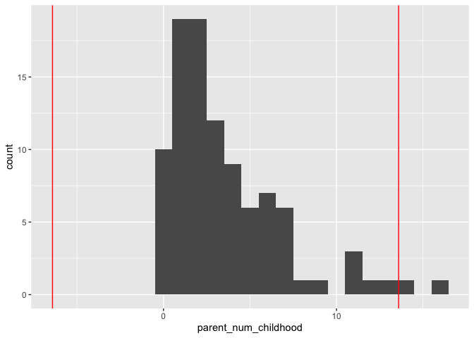<!-- -->

    ## 
    ## [[2]]

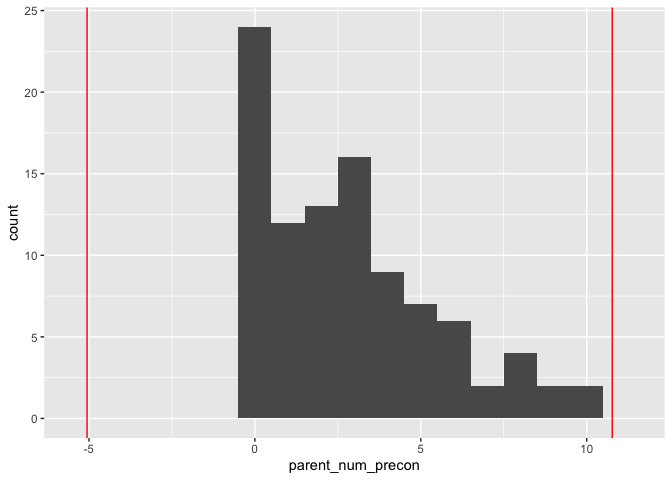<!-- -->

    ## 
    ## [[3]]

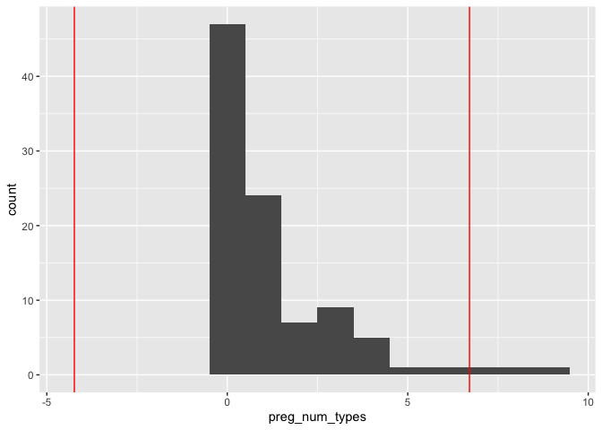<!-- -->

    ## 
    ## [[4]]

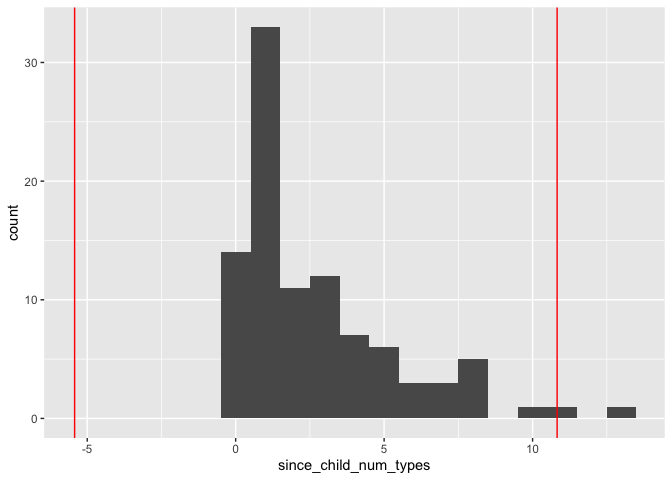<!-- -->

    ## 
    ## [[5]]

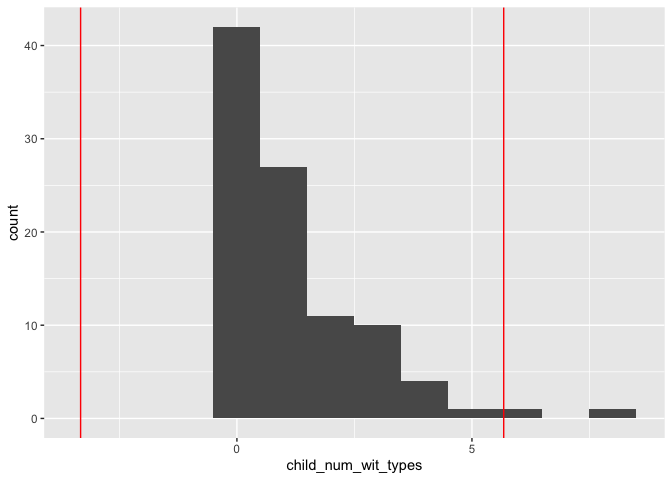<!-- -->

    ## 
    ## [[6]]

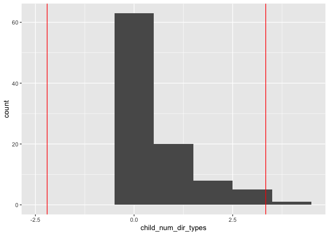<!-- -->

    ## 
    ## [[7]]

    ## Warning: Removed 1 rows containing non-finite values (stat_bin).

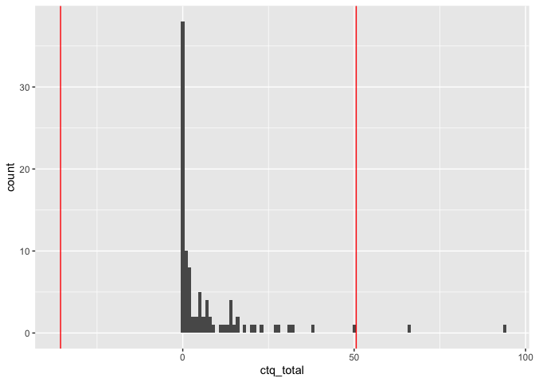<!-- -->

    ## 
    ## [[8]]

    ## Warning: Removed 1 rows containing non-finite values (stat_bin).

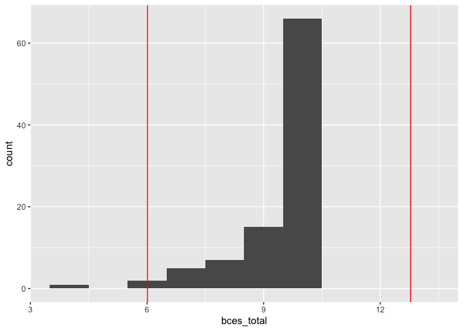<!-- -->

    ## 
    ## [[9]]

    ## Warning: Removed 1 rows containing non-finite values (stat_bin).

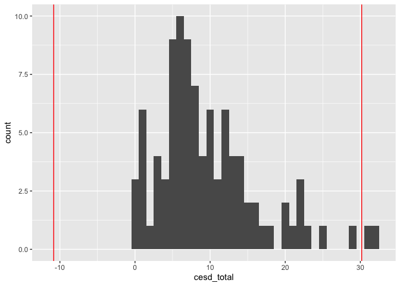<!-- -->

    ## 
    ## [[10]]

    ## Warning: Removed 1 rows containing non-finite values (stat_bin).

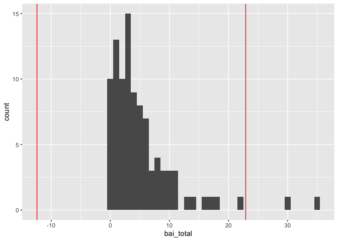<!-- -->

    ## 
    ## [[11]]

    ## Warning: Removed 1 rows containing non-finite values (stat_bin).

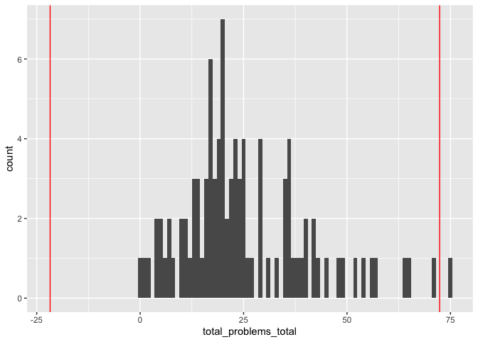<!-- -->

    ## 
    ## [[12]]

    ## Warning: Removed 16 rows containing non-finite values (stat_bin).

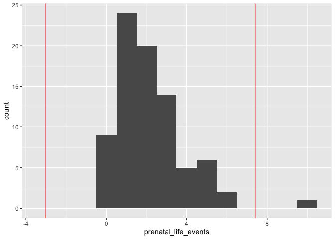<!-- -->

``` r
df <-
  df %>% 
  # winsorize to 3SD variables with outliers beyond that value
  mutate_at(
    vars(
      ctq_total,
      bai_total,
      bces_total,
      parent_num_childhood,
      preg_num_types,
      since_child_num_types,
      child_num_wit_types,
      child_num_dir_types,
      cesd_total,
      bai_total,
      total_problems_total,
      prenatal_life_events
    ),
    .funs = funs("W" = winsorize(., product = 3))
  ) %>% 
  # round winsorized count variables to nearest integer
  mutate_at(
    vars(
      parent_num_childhood_W,
      preg_num_types_W,
      since_child_num_types_W,
      child_num_wit_types_W,
      child_num_dir_types_W,
      prenatal_life_events_W
    ),
    .funs = funs(round(., digits = 0)) 
  )
```

## Categorical variables

``` r
df %>% 
  count(mom_poc) %>% 
  mutate(per = n / sum(n))
```

    ## # A tibble: 2 x 3
    ##   mom_poc     n   per
    ## *   <dbl> <int> <dbl>
    ## 1       0    66 0.680
    ## 2       1    31 0.320

``` r
df %>% 
  count(mom_white) %>% 
  mutate(per = n / sum(n))
```

    ## # A tibble: 2 x 3
    ##   mom_white     n   per
    ## *     <dbl> <int> <dbl>
    ## 1         0    28 0.289
    ## 2         1    69 0.711

``` r
df %>% 
  count(mom_black) %>% 
  mutate(per = n / sum(n))
```

    ## # A tibble: 2 x 3
    ##   mom_black     n    per
    ## *     <dbl> <int>  <dbl>
    ## 1         0    93 0.959 
    ## 2         1     4 0.0412

``` r
df %>% 
  count(mom_asian) %>% 
  mutate(per = n / sum(n))
```

    ## # A tibble: 2 x 3
    ##   mom_asian     n   per
    ## *     <dbl> <int> <dbl>
    ## 1         0    76 0.784
    ## 2         1    21 0.216

``` r
df %>% 
  count(mom_anative) %>% 
  mutate(per = n / sum(n))
```

    ## # A tibble: 2 x 3
    ##   mom_anative     n    per
    ## *       <dbl> <int>  <dbl>
    ## 1           0    95 0.979 
    ## 2           1     2 0.0206

``` r
df %>% 
  count(mom_pnative) %>% 
  mutate(per = n / sum(n))
```

    ## # A tibble: 1 x 3
    ##   mom_pnative     n   per
    ## *       <dbl> <int> <dbl>
    ## 1           0    97     1

``` r
df %>% 
  count(mom_other_race) %>% 
  mutate(per = n / sum(n))
```

    ## # A tibble: 2 x 3
    ##   mom_other_race     n    per
    ## *          <dbl> <int>  <dbl>
    ## 1              0    92 0.948 
    ## 2              1     5 0.0515

``` r
df %>% 
  count(mom_decline_race) %>% 
  mutate(per = n / sum(n))
```

    ## # A tibble: 1 x 3
    ##   mom_decline_race     n   per
    ## *            <dbl> <int> <dbl>
    ## 1                0    97     1

``` r
df %>% 
  count(mom_latinx) %>% 
  mutate(per = n / sum(n))
```

    ## # A tibble: 2 x 3
    ##   mom_latinx     n   per
    ## *      <dbl> <int> <dbl>
    ## 1          0    80 0.825
    ## 2          1    17 0.175

``` r
df %>% 
  count(primary_english) %>% 
  mutate(per = n / sum(n))
```

    ## # A tibble: 2 x 3
    ##   primary_english     n   per
    ## *           <dbl> <int> <dbl>
    ## 1               0    26 0.268
    ## 2               1    71 0.732

``` r
df %>% 
  count(education) %>% 
  mutate(per = n / sum(n))
```

    ## # A tibble: 8 x 3
    ##   education                                                      n    per
    ## * <chr>                                                      <int>  <dbl>
    ## 1 Associate degree                                               5 0.0515
    ## 2 Bachelor's degree                                             25 0.258 
    ## 3 Graduate degree                                               54 0.557 
    ## 4 High school graduate, diploma or the equivalent (i.e. GED)     1 0.0103
    ## 5 No schooling completed                                         1 0.0103
    ## 6 Other                                                          1 0.0103
    ## 7 Some college credit, no degree                                 8 0.0825
    ## 8 Trade/technical/vocational training                            2 0.0206

``` r
df %>% 
  mutate(
    education_re = case_when(
      education != "Bachelor's degree" & education != "Graduate degree" ~ "< 4yr college",
      education == "Bachelor's degree" ~ "Bachelor's degree",
      education == "Graduate degree" ~ "Graduate degree"
    )
  ) %>% 
  count(education_re) %>% 
  mutate(per = n / sum(n))
```

    ## # A tibble: 3 x 3
    ##   education_re          n   per
    ## * <chr>             <int> <dbl>
    ## 1 < 4yr college        18 0.186
    ## 2 Bachelor's degree    25 0.258
    ## 3 Graduate degree      54 0.557

``` r
df %>% 
  count(annual_income) %>% 
  mutate(per = n / sum(n)) %>% 
  arrange(per)
```

    ## # A tibble: 11 x 3
    ##    annual_income           n    per
    ##    <chr>               <int>  <dbl>
    ##  1 $10,000 or less         1 0.0103
    ##  2 $10,001 - $30,000       2 0.0206
    ##  3 $30,001 - $50,000       3 0.0309
    ##  4 $60,001 - $80,000       3 0.0309
    ##  5 Decline to answer       4 0.0412
    ##  6 $50,001 - $60,000       8 0.0825
    ##  7 $80,001- $100,000       8 0.0825
    ##  8 $100,001 - $150,000    13 0.134 
    ##  9 $200,001 - $250,000    13 0.134 
    ## 10 $150,001 - $200,000    16 0.165 
    ## 11 $250,001 or more       26 0.268

``` r
df %>% 
  count(inr_fpl <= 2) %>% 
  mutate(per = n / sum(n))
```

    ## # A tibble: 3 x 3
    ##   `inr_fpl <= 2`     n    per
    ## * <lgl>          <int>  <dbl>
    ## 1 FALSE             83 0.856 
    ## 2 TRUE              10 0.103 
    ## 3 NA                 4 0.0412

``` r
df %>% 
  count(marital_status) %>% 
  mutate(per = n / sum(n))
```

    ## # A tibble: 5 x 3
    ##   marital_status            n    per
    ## * <chr>                 <int>  <dbl>
    ## 1 Divorced                  1 0.0103
    ## 2 Living with partner       5 0.0515
    ## 3 Married                  88 0.907 
    ## 4 Separated                 1 0.0103
    ## 5 Single, never married     2 0.0206

``` r
df %>% 
  count(child_male) %>% 
  mutate(per = n / sum(n))
```

    ## # A tibble: 2 x 3
    ##   child_male     n   per
    ## *      <dbl> <int> <dbl>
    ## 1          0    46 0.474
    ## 2          1    51 0.526

## Correlations

``` r
apca_corr <- 
  df %>% 
  dplyr::select(
    parent_num_childhood,
    parent_num_precon,
    preg_num_types,
    since_child_num_types,
    child_num_dir_types,
    child_num_wit_types,
    inr_fpl,
    mom_age,
    child_age
  ) %>% 
  correlate(method = "spearman", use = "pairwise.complete.obs") %>% 
  shave(upper = FALSE) %>% 
  fashion()
```

    ## 
    ## Correlation method: 'spearman'
    ## Missing treated using: 'pairwise.complete.obs'

``` r
apca_corr
```

    ##                    term parent_num_childhood parent_num_precon preg_num_types
    ## 1  parent_num_childhood                                    .49            .28
    ## 2     parent_num_precon                                                   .26
    ## 3        preg_num_types                                                      
    ## 4 since_child_num_types                                                      
    ## 5   child_num_dir_types                                                      
    ## 6   child_num_wit_types                                                      
    ## 7               inr_fpl                                                      
    ## 8               mom_age                                                      
    ## 9             child_age                                                      
    ##   since_child_num_types child_num_dir_types child_num_wit_types inr_fpl mom_age
    ## 1                   .44                 .30                 .35    -.19     .04
    ## 2                   .25                 .19                 .12    -.11     .19
    ## 3                   .58                 .32                 .50    -.09     .12
    ## 4                                       .40                 .76    -.10     .09
    ## 5                                                           .38    -.12    -.04
    ## 6                                                                   .05     .17
    ## 7                                                                           .22
    ## 8                                                                              
    ## 9                                                                              
    ##   child_age
    ## 1       .05
    ## 2       .09
    ## 3      -.02
    ## 4       .14
    ## 5       .25
    ## 6       .23
    ## 7       .10
    ## 8       .23
    ## 9

``` r
SpearmanRho(df$parent_num_childhood, df$child_num_dir_types, conf.level = .95)
```

    ##       rho    lwr.ci    upr.ci 
    ## 0.3049930 0.1123839 0.4755131

``` r
SpearmanRho(df$parent_num_precon, df$child_num_dir_types, conf.level = .95)
```

    ##         rho      lwr.ci      upr.ci 
    ##  0.18693391 -0.01299596  0.37249161

``` r
SpearmanRho(df$preg_num_types, df$child_num_dir_types, conf.level = .95)
```

    ##       rho    lwr.ci    upr.ci 
    ## 0.3246606 0.1338846 0.4922329

``` r
SpearmanRho(df$since_child_num_types, df$child_num_dir_types, conf.level = .95)
```

    ##       rho    lwr.ci    upr.ci 
    ## 0.3997275 0.2176327 0.5549316

``` r
SpearmanRho(df$child_age, df$child_num_dir_types, conf.level = .95)
```

    ##        rho     lwr.ci     upr.ci 
    ## 0.25462714 0.05813409 0.43212724

``` r
SpearmanRho(df$child_age, df$child_num_wit_types, conf.level = .95)
```

    ##        rho     lwr.ci     upr.ci 
    ## 0.22850084 0.03044289 0.40929328

``` r
SpearmanRho(df$mom_age, df$parent_num_precon, conf.level = .95)
```

    ##          rho       lwr.ci       upr.ci 
    ##  0.193884843 -0.005784167  0.378686589

``` r
SpearmanRho(df$inr_fpl, df$parent_num_childhood, conf.level = .95, use = "complete.obs")
```

    ##         rho      lwr.ci      upr.ci 
    ## -0.18923890 -0.37836151  0.01504953

``` r
apca_corr_plot <- 
  apca_corr %>% 
  gather(variable, value, -term) %>% 
  mutate(
    term = as.character(term),
    value_chr = as.character(value),
    value_chr = case_when(
      term == "child_num_wit_types" & variable == "child_num_dir_types" ~ ".38",
      variable == "child_num_wit_types" & term == "child_num_dir_types" ~ NA_character_,
      TRUE ~ value_chr
    ),
   value_num = as.numeric(value_chr)
  ) %>% 
  na.omit() %>% 
  mutate(
    term = factor(
      term,
      levels = c(
        "parent_num_childhood", 
        "parent_num_precon", 
        "preg_num_types", 
        "since_child_num_types",
        "child_num_wit_types",
        "child_num_dir_types",
        "inr_fpl",
        "mom_age",
        "child_age"
      ),
      labels = c(
        "Maternal childhood adversity",
        "Preconception adversity",
        "Prenatal adversity",
        "Maternal adversity since birth",
        "Child witnessed adversity",
        "Child direct adversity",
        "Income-to-FPL ratio",
        "Maternal age",
        "Child age"
      )
    ),
    variable = factor(
      variable,
      levels = c(
        "parent_num_childhood", 
        "parent_num_precon", 
        "preg_num_types", 
        "since_child_num_types",
        "child_num_wit_types",
        "child_num_dir_types",
        "inr_fpl",
        "mom_age",
        "child_age"
      ),
      labels = c(
        "Maternal childhood adversity",
        "Preconception adversity",
        "Prenatal adversity",
        "Maternal adversity since birth",
        "Child witnessed adversity",
        "Child direct adversity",
        "Income-to-FPL ratio",
        "Maternal age",
        "Child age"
      )
    )
  )
```

``` r
apca_corr_plot %>% 
  ggplot(aes(x = fct_rev(variable), y = fct_rev(term))) +
  geom_tile(aes(fill = abs(value_num))) +
  geom_text(
    aes(label = value_chr), 
    size = 4
  ) +
  scale_fill_gradient2(
    low = "blue",
    high = "red",
    mid = "white",
    na.value = "white",
    midpoint = 0,
    limit = c(-1, 1),
    space = "Lab",
    name = "Spearman correlation\ncoefficient"
  ) +
  theme_void() +
  theme(
    axis.text.x = element_text(
      angle = 45,
      hjust = 1,
      vjust = 1,
      size = 12
    ),
    axis.text.y = element_text(
      size = 12,
      hjust = .9
    )
  ) 
```

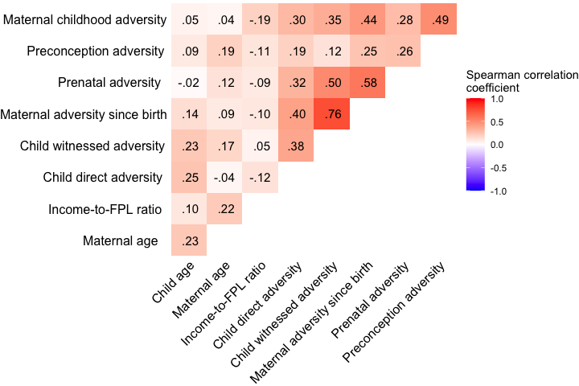<!-- -->

``` r
ggsave(
  "~/Box/lucy_king_files/MoD/APCA/figures/correlations.png",
  dpi = 500,
  height = 5,
  width = 7.5
)
```

``` r
df %>% 
  dplyr::select(
    cesd_total,
    bai_total_W,
    inr_fpl,
    mom_age,
    child_age
  ) %>% 
  correlate(method = "pearson", use = "complete.obs") %>% 
  shave(upper = FALSE) %>% 
  fashion()
```

    ## 
    ## Correlation method: 'pearson'
    ## Missing treated using: 'complete.obs'

    ##          term cesd_total bai_total_W inr_fpl mom_age child_age
    ## 1  cesd_total                    .69    -.07    -.15       .12
    ## 2 bai_total_W                           -.21    -.23       .02
    ## 3     inr_fpl                                    .26       .11
    ## 4     mom_age                                              .33
    ## 5   child_age

``` r
cor.test(df$bai_total, df$cesd_total)
```

    ## 
    ##  Pearson's product-moment correlation
    ## 
    ## data:  df$bai_total and df$cesd_total
    ## t = 9.2056, df = 94, p-value = 0.000000000000008988
    ## alternative hypothesis: true correlation is not equal to 0
    ## 95 percent confidence interval:
    ##  0.5662329 0.7811983
    ## sample estimates:
    ##       cor 
    ## 0.6885531

``` r
cor.test(df$mom_age, df$cesd_total)
```

    ## 
    ##  Pearson's product-moment correlation
    ## 
    ## data:  df$mom_age and df$cesd_total
    ## t = -1.3366, df = 94, p-value = 0.1846
    ## alternative hypothesis: true correlation is not equal to 0
    ## 95 percent confidence interval:
    ##  -0.32807462  0.06571364
    ## sample estimates:
    ##        cor 
    ## -0.1365716

``` r
cor.test(df$mom_age, df$bai_total)
```

    ## 
    ##  Pearson's product-moment correlation
    ## 
    ## data:  df$mom_age and df$bai_total
    ## t = -2.2144, df = 94, p-value = 0.02922
    ## alternative hypothesis: true correlation is not equal to 0
    ## 95 percent confidence interval:
    ##  -0.40506919 -0.02321659
    ## sample estimates:
    ##        cor 
    ## -0.2226661

``` r
df %>% 
  dplyr::select(
    total_problems_total,
    bai_total_W,
    cesd_total,
    inr_fpl,
    mom_age,
    child_age
  ) %>% 
  correlate(method = "pearson", use = "complete.obs") %>% 
  shave(upper = FALSE) %>% 
  fashion()
```

    ## 
    ## Correlation method: 'pearson'
    ## Missing treated using: 'complete.obs'

    ##                   term total_problems_total bai_total_W cesd_total inr_fpl
    ## 1 total_problems_total                              .23        .30     .00
    ## 2          bai_total_W                                         .69    -.19
    ## 3           cesd_total                                                -.07
    ## 4              inr_fpl                                                    
    ## 5              mom_age                                                    
    ## 6            child_age                                                    
    ##   mom_age child_age
    ## 1     .02       .09
    ## 2    -.22       .01
    ## 3    -.14       .12
    ## 4     .24       .13
    ## 5               .35
    ## 6

``` r
cor.test(df$total_problems_total, df$cesd_total)
```

    ## 
    ##  Pearson's product-moment correlation
    ## 
    ## data:  df$total_problems_total and df$cesd_total
    ## t = 2.9825, df = 93, p-value = 0.00365
    ## alternative hypothesis: true correlation is not equal to 0
    ## 95 percent confidence interval:
    ##  0.09987156 0.46907705
    ## sample estimates:
    ##       cor 
    ## 0.2954673

``` r
cor.test(df$total_problems_total, df$bai_total_W)
```

    ## 
    ##  Pearson's product-moment correlation
    ## 
    ## data:  df$total_problems_total and df$bai_total_W
    ## t = 2.3022, df = 93, p-value = 0.02355
    ## alternative hypothesis: true correlation is not equal to 0
    ## 95 percent confidence interval:
    ##  0.03216788 0.41435681
    ## sample estimates:
    ##       cor 
    ## 0.2322055

## t-tests

``` r
t.test(df$parent_num_childhood ~ df$mom_poc)
```

    ## 
    ##  Welch Two Sample t-test
    ## 
    ## data:  df$parent_num_childhood by df$mom_poc
    ## t = -0.27433, df = 77.825, p-value = 0.7846
    ## alternative hypothesis: true difference in means is not equal to 0
    ## 95 percent confidence interval:
    ##  -1.481171  1.122423
    ## sample estimates:
    ## mean in group 0 mean in group 1 
    ##        3.530303        3.709677

``` r
t.test(df$parent_num_childhood ~ df$mom_latinx)
```

    ## 
    ##  Welch Two Sample t-test
    ## 
    ## data:  df$parent_num_childhood by df$mom_latinx
    ## t = -0.78662, df = 22.916, p-value = 0.4396
    ## alternative hypothesis: true difference in means is not equal to 0
    ## 95 percent confidence interval:
    ##  -2.591965  1.164024
    ## sample estimates:
    ## mean in group 0 mean in group 1 
    ##        3.462500        4.176471

``` r
t.test(df$parent_num_precon ~ df$mom_poc)
```

    ## 
    ##  Welch Two Sample t-test
    ## 
    ## data:  df$parent_num_precon by df$mom_poc
    ## t = 0.45992, df = 60.678, p-value = 0.6472
    ## alternative hypothesis: true difference in means is not equal to 0
    ## 95 percent confidence interval:
    ##  -0.8771512  1.4011004
    ## sample estimates:
    ## mean in group 0 mean in group 1 
    ##        2.939394        2.677419

``` r
t.test(df$parent_num_precon ~ df$mom_latinx)
```

    ## 
    ##  Welch Two Sample t-test
    ## 
    ## data:  df$parent_num_precon by df$mom_latinx
    ## t = -1.0197, df = 19.626, p-value = 0.3203
    ## alternative hypothesis: true difference in means is not equal to 0
    ## 95 percent confidence interval:
    ##  -2.7074601  0.9309895
    ## sample estimates:
    ## mean in group 0 mean in group 1 
    ##        2.700000        3.588235

``` r
t.test(df$preg_num_types ~ df$mom_poc)
```

    ## 
    ##  Welch Two Sample t-test
    ## 
    ## data:  df$preg_num_types by df$mom_poc
    ## t = 0.43034, df = 71.811, p-value = 0.6682
    ## alternative hypothesis: true difference in means is not equal to 0
    ## 95 percent confidence interval:
    ##  -0.5770098  0.8947029
    ## sample estimates:
    ## mean in group 0 mean in group 1 
    ##        1.287879        1.129032

``` r
t.test(df$preg_num_types ~ df$mom_latinx)
```

    ## 
    ##  Welch Two Sample t-test
    ## 
    ## data:  df$preg_num_types by df$mom_latinx
    ## t = -0.51902, df = 21.138, p-value = 0.6091
    ## alternative hypothesis: true difference in means is not equal to 0
    ## 95 percent confidence interval:
    ##  -1.416912  0.850735
    ## sample estimates:
    ## mean in group 0 mean in group 1 
    ##        1.187500        1.470588

``` r
t.test(df$preg_num_types ~ df$child_male)
```

    ## 
    ##  Welch Two Sample t-test
    ## 
    ## data:  df$preg_num_types by df$child_male
    ## t = -0.32299, df = 94.462, p-value = 0.7474
    ## alternative hypothesis: true difference in means is not equal to 0
    ## 95 percent confidence interval:
    ##  -0.8591007  0.6186914
    ## sample estimates:
    ## mean in group 0 mean in group 1 
    ##        1.173913        1.294118

``` r
t.test(df$since_child_num_types ~ df$mom_poc)
```

    ## 
    ##  Welch Two Sample t-test
    ## 
    ## data:  df$since_child_num_types by df$mom_poc
    ## t = 0.95841, df = 61.336, p-value = 0.3416
    ## alternative hypothesis: true difference in means is not equal to 0
    ## 95 percent confidence interval:
    ##  -0.6041302  1.7165447
    ## sample estimates:
    ## mean in group 0 mean in group 1 
    ##        2.878788        2.322581

``` r
t.test(df$since_child_num_types ~ df$mom_latinx)
```

    ## 
    ##  Welch Two Sample t-test
    ## 
    ## data:  df$since_child_num_types by df$mom_latinx
    ## t = 0.64568, df = 26.293, p-value = 0.5241
    ## alternative hypothesis: true difference in means is not equal to 0
    ## 95 percent confidence interval:
    ##  -0.9208394  1.7649570
    ## sample estimates:
    ## mean in group 0 mean in group 1 
    ##        2.775000        2.352941

``` r
t.test(df$since_child_num_types ~ df$child_male)
```

    ## 
    ##  Welch Two Sample t-test
    ## 
    ## data:  df$since_child_num_types by df$child_male
    ## t = -0.1691, df = 94.867, p-value = 0.8661
    ## alternative hypothesis: true difference in means is not equal to 0
    ## 95 percent confidence interval:
    ##  -1.1839128  0.9980645
    ## sample estimates:
    ## mean in group 0 mean in group 1 
    ##        2.652174        2.745098

``` r
t.test(df$child_num_wit_types ~ df$mom_poc)
```

    ## 
    ##  Welch Two Sample t-test
    ## 
    ## data:  df$child_num_wit_types by df$mom_poc
    ## t = 0.18911, df = 47.68, p-value = 0.8508
    ## alternative hypothesis: true difference in means is not equal to 0
    ## 95 percent confidence interval:
    ##  -0.6545094  0.7903842
    ## sample estimates:
    ## mean in group 0 mean in group 1 
    ##        1.196970        1.129032

``` r
t.test(df$child_num_wit_types ~ df$mom_latinx)
```

    ## 
    ##  Welch Two Sample t-test
    ## 
    ## data:  df$child_num_wit_types by df$mom_latinx
    ## t = 0.55488, df = 24.563, p-value = 0.584
    ## alternative hypothesis: true difference in means is not equal to 0
    ## 95 percent confidence interval:
    ##  -0.5769478  1.0019478
    ## sample estimates:
    ## mean in group 0 mean in group 1 
    ##          1.2125          1.0000

``` r
t.test(df$child_num_wit_types ~ df$child_male)
```

    ## 
    ##  Welch Two Sample t-test
    ## 
    ## data:  df$child_num_wit_types by df$child_male
    ## t = -0.55191, df = 94.986, p-value = 0.5823
    ## alternative hypothesis: true difference in means is not equal to 0
    ## 95 percent confidence interval:
    ##  -0.7720600  0.4361691
    ## sample estimates:
    ## mean in group 0 mean in group 1 
    ##        1.086957        1.254902

``` r
t.test(df$child_num_dir_types ~ df$mom_poc)
```

    ## 
    ##  Welch Two Sample t-test
    ## 
    ## data:  df$child_num_dir_types by df$mom_poc
    ## t = 0.79416, df = 51.076, p-value = 0.4308
    ## alternative hypothesis: true difference in means is not equal to 0
    ## 95 percent confidence interval:
    ##  -0.2591221  0.5983205
    ## sample estimates:
    ## mean in group 0 mean in group 1 
    ##       0.6212121       0.4516129

``` r
t.test(df$child_num_dir_types ~ df$mom_latinx)
```

    ## 
    ##  Welch Two Sample t-test
    ## 
    ## data:  df$child_num_dir_types by df$mom_latinx
    ## t = 1.8452, df = 37.466, p-value = 0.07293
    ## alternative hypothesis: true difference in means is not equal to 0
    ## 95 percent confidence interval:
    ##  -0.03230546  0.69407017
    ## sample estimates:
    ## mean in group 0 mean in group 1 
    ##       0.6250000       0.2941176

``` r
t.test(df$child_num_dir_types ~ df$child_male)
```

    ## 
    ##  Welch Two Sample t-test
    ## 
    ## data:  df$child_num_dir_types by df$child_male
    ## t = -0.90646, df = 94.532, p-value = 0.367
    ## alternative hypothesis: true difference in means is not equal to 0
    ## 95 percent confidence interval:
    ##  -0.5385067  0.2009108
    ## sample estimates:
    ## mean in group 0 mean in group 1 
    ##       0.4782609       0.6470588

``` r
t.test(df$cesd_total_W ~ df$mom_poc)
```

    ## 
    ##  Welch Two Sample t-test
    ## 
    ## data:  df$cesd_total_W by df$mom_poc
    ## t = 1.4461, df = 73.396, p-value = 0.1524
    ## alternative hypothesis: true difference in means is not equal to 0
    ## 95 percent confidence interval:
    ##  -0.737636  4.640265
    ## sample estimates:
    ## mean in group 0 mean in group 1 
    ##       10.279684        8.328369

``` r
t.test(df$cesd_total_W ~ df$mom_latinx)
```

    ## 
    ##  Welch Two Sample t-test
    ## 
    ## data:  df$cesd_total_W by df$mom_latinx
    ## t = -1.6283, df = 22.118, p-value = 0.1176
    ## alternative hypothesis: true difference in means is not equal to 0
    ## 95 percent confidence interval:
    ##  -7.0095762  0.8425994
    ## sample estimates:
    ## mean in group 0 mean in group 1 
    ##        9.103537       12.187026

``` r
t.test(df$cesd_total_W ~ df$child_male)
```

    ## 
    ##  Welch Two Sample t-test
    ## 
    ## data:  df$cesd_total_W by df$child_male
    ## t = 0.063262, df = 83.786, p-value = 0.9497
    ## alternative hypothesis: true difference in means is not equal to 0
    ## 95 percent confidence interval:
    ##  -2.709417  2.887458
    ## sample estimates:
    ## mean in group 0 mean in group 1 
    ##        9.696864        9.607843

``` r
t.test(df$bai_total_W ~ df$mom_poc)
```

    ## 
    ##  Welch Two Sample t-test
    ## 
    ## data:  df$bai_total_W by df$mom_poc
    ## t = 1.0892, df = 69.259, p-value = 0.2798
    ## alternative hypothesis: true difference in means is not equal to 0
    ## 95 percent confidence interval:
    ##  -0.9367692  3.1901134
    ## sample estimates:
    ## mean in group 0 mean in group 1 
    ##        5.413917        4.287245

``` r
t.test(df$bai_total_W ~ df$mom_latinx)
```

    ## 
    ##  Welch Two Sample t-test
    ## 
    ## data:  df$bai_total_W by df$mom_latinx
    ## t = -0.98561, df = 20.837, p-value = 0.3356
    ## alternative hypothesis: true difference in means is not equal to 0
    ## 95 percent confidence interval:
    ##  -4.702934  1.679488
    ## sample estimates:
    ## mean in group 0 mean in group 1 
    ##        4.782394        6.294118

``` r
t.test(df$bai_total_W ~ df$child_male)
```

    ## 
    ##  Welch Two Sample t-test
    ## 
    ## data:  df$bai_total_W by df$child_male
    ## t = 0.066056, df = 87.909, p-value = 0.9475
    ## alternative hypothesis: true difference in means is not equal to 0
    ## 95 percent confidence interval:
    ##  -2.007824  2.145887
    ## sample estimates:
    ## mean in group 0 mean in group 1 
    ##        5.086768        5.017737

``` r
t.test(df$total_problems_total_W ~ df$mom_poc)
```

    ## 
    ##  Welch Two Sample t-test
    ## 
    ## data:  df$total_problems_total_W by df$mom_poc
    ## t = -0.1469, df = 65.326, p-value = 0.8837
    ## alternative hypothesis: true difference in means is not equal to 0
    ## 95 percent confidence interval:
    ##  -7.062090  6.094265
    ## sample estimates:
    ## mean in group 0 mean in group 1 
    ##        25.12899        25.61290

``` r
t.test(df$total_problems_total_W ~ df$mom_latinx)
```

    ## 
    ##  Welch Two Sample t-test
    ## 
    ## data:  df$total_problems_total_W by df$mom_latinx
    ## t = -0.68953, df = 21.963, p-value = 0.4977
    ## alternative hypothesis: true difference in means is not equal to 0
    ## 95 percent confidence interval:
    ##  -11.553727   5.788337
    ## sample estimates:
    ## mean in group 0 mean in group 1 
    ##        24.80481        27.68750

``` r
t.test(df$total_problems_total_W ~ df$child_male)
```

    ## 
    ##  Welch Two Sample t-test
    ## 
    ## data:  df$total_problems_total_W by df$child_male
    ## t = -0.43879, df = 92.232, p-value = 0.6618
    ## alternative hypothesis: true difference in means is not equal to 0
    ## 95 percent confidence interval:
    ##  -7.781657  4.965327
    ## sample estimates:
    ## mean in group 0 mean in group 1 
    ##        24.55183        25.96000

## Additional APCA descriptives

``` r
# proportion of maternal adversities since the child's birth that the child witnessed
df <-
  df %>% 
  mutate(
    apca_prop_child_wit = child_num_wit_types / since_child_num_types
  ) 

df %>% 
  summarise_at(
    vars(apca_prop_child_wit),
    funs(mean, median, sd, min, max), na.rm = TRUE
  )
```

    ## # A tibble: 1 x 5
    ##    mean median    sd   min   max
    ##   <dbl>  <dbl> <dbl> <dbl> <dbl>
    ## 1 0.426    0.4 0.387     0     1

# Primary statistical analyses

## Convergent validity

### CTQ

#### Spearman’s correlations

``` r
SpearmanRho(df$parent_num_childhood_W, df$ctq_total_W, use = "complete.obs", conf.level = .95)
```

    ##       rho    lwr.ci    upr.ci 
    ## 0.5777309 0.4266642 0.6974351

``` r
SpearmanRho(df$parent_num_precon, df$ctq_total_W, use = "complete.obs", conf.level = .95)
```

    ##       rho    lwr.ci    upr.ci 
    ## 0.4041576 0.2216299 0.5593228

``` r
SpearmanRho(df$preg_num_types_W, df$ctq_total_W, use = "complete.obs", conf.level = .95)
```

    ##         rho      lwr.ci      upr.ci 
    ##  0.19002633 -0.01087389  0.37618069

``` r
SpearmanRho(df$since_child_num_types_W, df$ctq_total_W, use = "complete.obs", conf.level = .95)
```

    ##       rho    lwr.ci    upr.ci 
    ## 0.3057105 0.1120949 0.4769630

#### Bayes Factors

``` r
childhood_ctq <- correlationBF(df$parent_num_childhood_W, df$ctq_total_W)
```

    ## Ignored 1 rows containing missing observations.

``` r
childhood_ctq <- describe_posterior(childhood_ctq, ci = 0.95)$BF

precon_ctq <- correlationBF(df$parent_num_precon, df$ctq_total_W)
```

    ## Ignored 1 rows containing missing observations.

``` r
precon_ctq <- describe_posterior(precon_ctq, ci = 0.95)$BF

preg_ctq <- correlationBF(df$preg_num_types_W, df$ctq_total_W)
```

    ## Ignored 1 rows containing missing observations.

``` r
preg_ctq <- describe_posterior(preg_ctq, ci = 0.95)$BF

since_ctq <- correlationBF(df$since_child_num_types_W, df$ctq_total_W)
```

    ## Ignored 1 rows containing missing observations.

``` r
since_ctq <-describe_posterior(since_ctq, ci = 0.95)$BF

con_BFs <-
  tibble(
    key = c(
      "parent_num_childhood",
      "parent_num_precon",
      "preg_num_types",
      "since_child_num_types"
    ),
    BF_ctq = c(
      childhood_ctq,
      precon_ctq,
      preg_ctq,
      since_ctq
    )
  )

con_BFs
```

    ## # A tibble: 4 x 2
    ##   key                         BF_ctq
    ##   <chr>                        <dbl>
    ## 1 parent_num_childhood  26759799.   
    ## 2 parent_num_precon          469.   
    ## 3 preg_num_types               1.25 
    ## 4 since_child_num_types        0.955

Initially identified overdispersion using a poisson model. Used negative
binomial regression to account for this.

#### Negative binomial model

``` r
glm.1 <- glm.nb(
  parent_num_childhood_W  ~ 
    scale(ctq_total_W, scale = FALSE),
  data = df
)
```

#### Diagnostics

``` r
check_model(glm.1)
```

    ## Loading required namespace: qqplotr

    ## `geom_smooth()` using formula 'y ~ x'

    ## `stat_bin()` using `bins = 30`. Pick better value with `binwidth`.

    ## Warning: Removed 96 rows containing missing values (geom_text_repel).

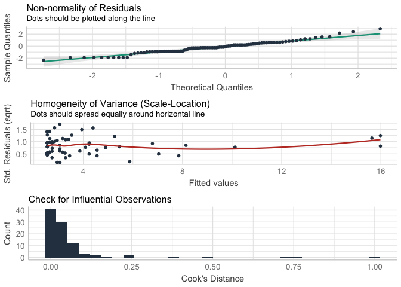<!-- -->

``` r
check_heteroscedasticity(glm.1)
```

    ## OK: Error variance appears to be homoscedastic (p = 0.615).

#### Performance

``` r
model_performance(glm.1)
```

    ## # Indices of model performance
    ## 
    ## AIC     |     BIC | Nagelkerke's R2 |  RMSE | Sigma | Score_log | Score_spherical
    ## ---------------------------------------------------------------------------------
    ## 428.053 | 435.746 |           0.411 | 2.973 | 1.052 |    -2.200 |           0.093

#### Parameters

``` r
model_parameters(
  glm.1,
  exponentiate = TRUE
) 
```

    ## Parameter   |  IRR |       SE |       95% CI |     z |      p
    ## -------------------------------------------------------------
    ## (Intercept) | 3.27 |     0.26 | [2.80, 3.81] | 15.01 | < .001
    ## ctq_total_W | 1.04 | 5.98e-03 | [1.02, 1.05] |  6.30 | < .001

For each 1-unit increase in CTQ, the expected log count of APCA maternal
cumulative adversity increases by .02. For each 1-unit increase in CTQ,
the incidence rate for maternal cumulative adversity increased by 2%.

#### Plot expected counts

``` r
# create new dataset with only CTQ
df_new <-
  df %>% 
  dplyr::select(
    ctq_total_W
  ) 

# generate predicted values
df_new$pred <-
  predict(
    glm.1,
    df_new,
    type = "response"
  )

# plot
ctq_plot <-
  df_new %>% 
  ggplot(aes(ctq_total_W, pred)) +
  geom_smooth(color = "black", size = 3) +
  geom_jitter2(
    data = df,
    aes(ctq_total_W, parent_num_childhood),
    size = 5, 
    alpha = 1/3,
    color = "black"
  ) +
  scale_y_continuous(breaks = seq.int(0, 25, 5)) +
  scale_x_continuous(breaks = seq.int(0, 50, 5)) +
  theme_mod +
  labs(
    title = "Convergent validity",
    x = "CTQ-SF\nMaternal childhood maltreatment",
    y = "APCA\nMaternal childhood adversity"
  )

ctq_plot
```

    ## `geom_smooth()` using method = 'loess' and formula 'y ~ x'

    ## Warning: Removed 1 rows containing non-finite values (stat_smooth).

    ## Warning: Removed 1 rows containing missing values (geom_point).

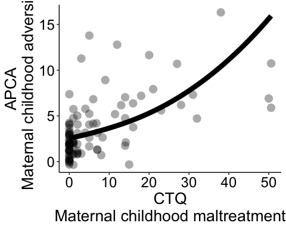<!-- -->

``` r
ggsave(
  "~/Box/lucy_king_files/MoD/APCA/figures/ctq_num_types.png",
  dpi = 500,
  height = 5,
  width = 6
)
```

    ## `geom_smooth()` using method = 'loess' and formula 'y ~ x'

    ## Warning: Removed 1 rows containing non-finite values (stat_smooth).
    
    ## Warning: Removed 1 rows containing missing values (geom_point).

### Life events measured in pregnancy

#### Spearman’s correlations

``` r
SpearmanRho(df$parent_num_childhood_W, df$prenatal_life_events_W, use = "complete.obs", conf.level = .95)
```

    ##        rho     lwr.ci     upr.ci 
    ## 0.29007860 0.07657963 0.47814314

``` r
SpearmanRho(df$parent_num_precon, df$prenatal_life_events_W, use = "complete.obs", conf.level = .95)
```

    ##        rho     lwr.ci     upr.ci 
    ## 0.27901929 0.06460591 0.46880722

#### Bayes Factors

``` r
childhood_le <- correlationBF(df$parent_num_childhood_W, df$prenatal_life_events_W)
```

    ## Ignored 16 rows containing missing observations.

``` r
childhood_le  <- describe_posterior(childhood_le, ci = 0.95)$BF

precon_le  <- correlationBF(df$parent_num_precon, df$prenatal_life_events_W)
```

    ## Ignored 16 rows containing missing observations.

``` r
precon_le  <- describe_posterior(precon_le, ci = 0.95)$BF


con_BFs <-
  con_BFs %>% 
  cbind(
    BF_le = c(
      childhood_le,
      precon_le,
      NA_real_,
      NA_real_
    )
  )

con_BFs
```

    ##                     key           BF_ctq     BF_le
    ## 1  parent_num_childhood 26759799.2827911  4.388674
    ## 2     parent_num_precon      469.2980266 11.532945
    ## 3        preg_num_types        1.2469527        NA
    ## 4 since_child_num_types        0.9546684        NA

#### Negative binomial model

``` r
glm.2 <- glm.nb(
  parent_num_childhood_W  ~ 
    scale(prenatal_life_events_W, scale = FALSE),
  data = df
)

glm.3 <- glm.nb(
  parent_num_precon  ~ 
    scale(prenatal_life_events_W, scale = FALSE),
  data = df
)
```

#### Diagnostics

``` r
check_model(glm.2)
```

    ## `geom_smooth()` using formula 'y ~ x'

    ## `stat_bin()` using `bins = 30`. Pick better value with `binwidth`.

    ## Warning: Removed 81 rows containing missing values (geom_text_repel).

<!-- -->

``` r
check_heteroscedasticity(glm.2)
```

    ## OK: Error variance appears to be homoscedastic (p = 0.790).

``` r
check_model(glm.3)
```

    ## `geom_smooth()` using formula 'y ~ x'
    ## `stat_bin()` using `bins = 30`. Pick better value with `binwidth`.

    ## Warning: Removed 81 rows containing missing values (geom_text_repel).

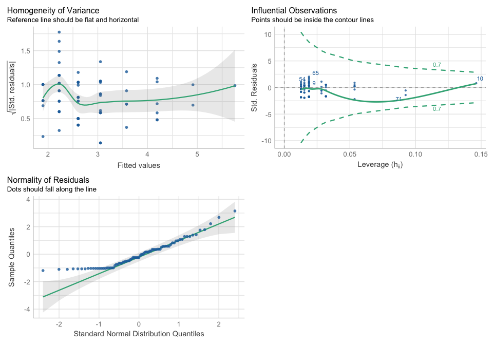<!-- -->

``` r
check_heteroscedasticity(glm.3)
```

    ## OK: Error variance appears to be homoscedastic (p = 0.231).

#### Performance

``` r
model_performance(glm.2)
```

    ## # Indices of model performance
    ## 
    ## AIC     |     BIC | Nagelkerke's R2 |  RMSE | Sigma | Score_log | Score_spherical
    ## ---------------------------------------------------------------------------------
    ## 375.976 | 383.159 |           0.111 | 2.924 | 1.057 |    -2.284 |           0.101

``` r
model_performance(glm.3)
```

    ## # Indices of model performance
    ## 
    ## AIC     |     BIC | Nagelkerke's R2 |  RMSE | Sigma | Score_log | Score_spherical
    ## ---------------------------------------------------------------------------------
    ## 349.711 | 356.894 |           0.107 | 2.351 | 1.110 |    -2.125 |           0.101

#### Parameters

``` r
model_parameters(
  glm.2,
  exponentiate = TRUE
) 
```

    ## Parameter              |  IRR |   SE |       95% CI |     z |      p
    ## --------------------------------------------------------------------
    ## (Intercept)            | 3.44 | 0.31 | [2.88, 4.12] | 13.57 | < .001
    ## prenatal_life_events_W | 1.15 | 0.06 | [1.03, 1.29] |  2.57 | 0.010

``` r
model_parameters(
  glm.3,
  exponentiate = TRUE
) 
```

    ## Parameter              |  IRR |   SE |       95% CI |    z |      p
    ## -------------------------------------------------------------------
    ## (Intercept)            | 2.67 | 0.28 | [2.18, 3.29] | 9.38 | < .001
    ## prenatal_life_events_W | 1.17 | 0.07 | [1.04, 1.33] | 2.49 | 0.013

For each 1-unit increase in CTQ, the expected log count of APCA maternal
cumulative adversity increases by .02. For each 1-unit increase in CTQ,
the incidence rate for maternal cumulative adversity increased by 2%.

#### Plot expected counts

``` r
# create new dataset with only CTQ
df_new <-
  df %>% 
  dplyr::select(
    ctq_total_W
  ) 

# generate predicted values
df_new$pred <-
  predict(
    glm.1,
    df_new,
    type = "response"
  )

# plot
ctq_plot <-
  df_new %>% 
  ggplot(aes(ctq_total_W, pred)) +
  geom_smooth(color = "black", size = 3) +
  geom_jitter2(
    data = df,
    aes(ctq_total_W, parent_num_childhood_W),
    size = 5, 
    alpha = 1/3,
    color = "black"
  ) +
  scale_y_continuous(breaks = seq.int(0, 14, 2)) +
  scale_x_continuous(breaks = seq.int(0, 50, 5)) +
  theme_mod +
  labs(
    title = "Convergent validity",
    x = "CTQ-SF\nMaternal childhood maltreatment",
    y = "APCA\nMaternal childhood adversity"
  )

ctq_plot
```

    ## `geom_smooth()` using method = 'loess' and formula 'y ~ x'

    ## Warning: Removed 1 rows containing non-finite values (stat_smooth).

    ## Warning: Removed 1 rows containing missing values (geom_point).

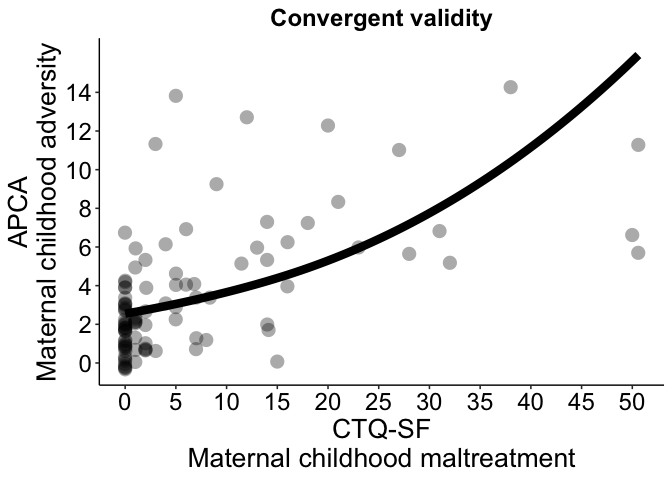<!-- -->

``` r
ggsave(
  "~/Box/lucy_king_files/MoD/APCA/figures/ctq_num_types.png",
  dpi = 500,
  height = 5,
  width = 6
)
```

    ## `geom_smooth()` using method = 'loess' and formula 'y ~ x'

    ## Warning: Removed 1 rows containing non-finite values (stat_smooth).
    
    ## Warning: Removed 1 rows containing missing values (geom_point).

## Discriminant validity

### BCES

#### Spearman’s correlations

``` r
SpearmanRho(df$parent_num_childhood_W, df$bces_total_W, use = "complete.obs", conf.level = .95)
```

    ##        rho     lwr.ci     upr.ci 
    ## -0.3098653 -0.4805008 -0.1166245

``` r
SpearmanRho(df$parent_num_precon, df$bces_total_W, use = "complete.obs", conf.level = .95)
```

    ##         rho      lwr.ci      upr.ci 
    ## -0.26133914 -0.43883253 -0.06421788

``` r
SpearmanRho(df$preg_num_types_W, df$bces_total_W, use = "complete.obs", conf.level = .95)
```

    ##         rho      lwr.ci      upr.ci 
    ## -0.25700079 -0.43506974 -0.05958496

``` r
SpearmanRho(df$since_child_num_types_W, df$bces_total_W, use = "complete.obs", conf.level = .95)
```

    ##        rho     lwr.ci     upr.ci 
    ## -0.1093061 -0.3031487  0.0932228

#### Bayes Factors

``` r
childhood_bce <- correlationBF(df$parent_num_childhood_W, df$bces_total_W)
```

    ## Ignored 1 rows containing missing observations.

``` r
childhood_bce  <- describe_posterior(childhood_bce, ci = 0.95)$BF

precon_bce  <- correlationBF(df$parent_num_precon, df$bces_total_W)
```

    ## Ignored 1 rows containing missing observations.

``` r
precon_bce  <- describe_posterior(precon_bce, ci = 0.95)$BF

preg_bce <- correlationBF(df$preg_num_types_W, df$bces_total_W)
```

    ## Ignored 1 rows containing missing observations.

``` r
preg_bce <- describe_posterior(preg_bce, ci = 0.95)$BF

since_bce <- correlationBF(df$since_child_num_types_W, df$bces_total_W)
```

    ## Ignored 1 rows containing missing observations.

``` r
since_bce <-describe_posterior(since_bce, ci = 0.95)$BF

dis_BFs <-
  tibble(
    key = c(
      "parent_num_childhood",
      "parent_num_precon",
      "preg_num_types",
      "since_child_num_types"
    ),
    BF_bce = c(
      childhood_bce,
      precon_bce,
      preg_bce,
      since_bce
    )
  )

dis_BFs
```

    ## # A tibble: 4 x 2
    ##   key                    BF_bce
    ##   <chr>                   <dbl>
    ## 1 parent_num_childhood   57.6  
    ## 2 parent_num_precon     204.   
    ## 3 preg_num_types         30.7  
    ## 4 since_child_num_types   0.968

#### Negative binomial model

``` r
glm.4 <- glm.nb(
  parent_num_childhood  ~ 
    scale(bces_total_W, scale = FALSE),
  data = df
)
```

#### Diagnostics

``` r
check_model(glm.4)
```

    ## `geom_smooth()` using formula 'y ~ x'

    ## Warning in simpleLoess(y, x, w, span, degree = degree, parametric =
    ## parametric, : pseudoinverse used at 2.9816

    ## Warning in simpleLoess(y, x, w, span, degree = degree, parametric =
    ## parametric, : neighborhood radius 0.87673

    ## Warning in simpleLoess(y, x, w, span, degree = degree, parametric =
    ## parametric, : reciprocal condition number 0

    ## Warning in simpleLoess(y, x, w, span, degree = degree, parametric =
    ## parametric, : There are other near singularities as well. 0.72443

    ## `stat_bin()` using `bins = 30`. Pick better value with `binwidth`.

    ## Warning: Removed 96 rows containing missing values (geom_text_repel).

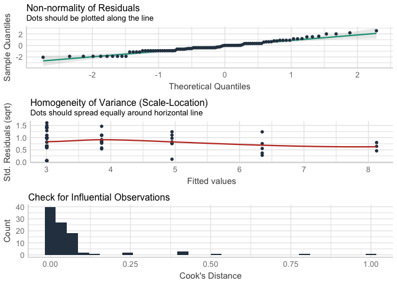<!-- -->

``` r
check_heteroscedasticity(glm.4)
```

    ## OK: Error variance appears to be homoscedastic (p = 0.142).

#### Performance

``` r
model_performance(glm.4)
```

    ## # Indices of model performance
    ## 
    ## AIC     |     BIC | Nagelkerke's R2 |  RMSE | Sigma | Score_log | Score_spherical
    ## ---------------------------------------------------------------------------------
    ## 449.580 | 457.273 |           0.156 | 3.120 | 1.055 |    -2.318 |           0.093

#### Parameters

``` r
model_parameters(
  glm.4,
  exponentiate = TRUE
) 
```

    ## Parameter    |  IRR |   SE |       95% CI |     z |      p
    ## ----------------------------------------------------------
    ## (Intercept)  | 3.48 | 0.30 | [2.94, 4.12] | 14.40 | < .001
    ## bces_total_W | 0.78 | 0.06 | [0.67, 0.90] | -3.23 | 0.001

For each 1-unit increase in BCEs, the incidence rate for maternal
cumulative adversity decreases by 22%.

#### Plot expected counts

``` r
# create new dataset with BCEs only
df_new.1 <-
  df %>% 
  dplyr::select(
    bces_total_W
  )

# generate predicted values
df_new.1$pred <-
  predict(
    glm.4,
    df_new.1,
    type = "response"
  )

# plot
bces_plot <-
  df_new.1 %>% 
  ggplot(aes(bces_total_W, pred)) +
  geom_smooth(color = "black", size = 3, span = 1) +
  geom_jitter2(
    data = df,
    aes(bces_total_W, parent_num_childhood_W),
    size = 5, 
    alpha = 1/3,
    color = "black"
  ) +
  scale_y_continuous(breaks = seq.int(0, 15, 2)) +
  scale_x_continuous(breaks = seq.int(0, 10, 1)) +
  theme_mod +
  labs(
    title = "Discriminant validity",
    x = "BCEs\n Maternal positive childhood experiences",
    y = NULL
  )

bces_plot
```

    ## `geom_smooth()` using method = 'loess' and formula 'y ~ x'

    ## Warning: Removed 1 rows containing non-finite values (stat_smooth).

    ## Warning: Removed 1 rows containing missing values (geom_point).

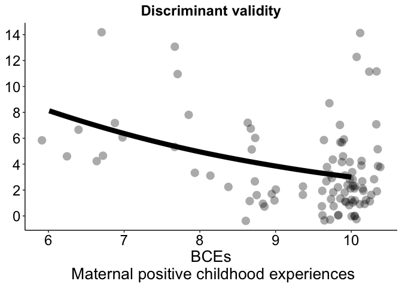<!-- -->

``` r
ggsave(
  "~/Box/lucy_king_files/MoD/APCA/figures/bces_num_types.png",
  dpi = 500,
  height = 5,
  width = 4
)
```

    ## `geom_smooth()` using method = 'loess' and formula 'y ~ x'

    ## Warning: Removed 1 rows containing non-finite values (stat_smooth).
    
    ## Warning: Removed 1 rows containing missing values (geom_point).

### Arrange CTQ and BCEs plots

``` r
ctq_bces_plots <- arrangeGrob(
  ctq_plot, 
  bces_plot, 
  nrow = 1
)
```

    ## `geom_smooth()` using method = 'loess' and formula 'y ~ x'

    ## Warning: Removed 1 rows containing non-finite values (stat_smooth).

    ## Warning: Removed 1 rows containing missing values (geom_point).

    ## `geom_smooth()` using method = 'loess' and formula 'y ~ x'

    ## Warning: Removed 1 rows containing non-finite values (stat_smooth).
    
    ## Warning: Removed 1 rows containing missing values (geom_point).

``` r
ggsave(
  "~/Box/lucy_king_files/MoD/APCA/figures/ctq_bces_apca_childhood.png",
  ctq_bces_plots,
  dpi = 1000,
  height = 5,
  width = 10
)
```

## Concurrent validity

### CESD

#### Spearman’s correlations

``` r
SpearmanRho(df$parent_num_childhood_W, df$cesd_total_W, use = "complete.obs", conf.level = .95)
```

    ##         rho      lwr.ci      upr.ci 
    ##  0.13158689 -0.07076595  0.32353749

``` r
SpearmanRho(df$parent_num_precon, df$cesd_total_W, use = "complete.obs", conf.level = .95)
```

    ##        rho     lwr.ci     upr.ci 
    ## 0.27814876 0.08224945 0.45335349

``` r
SpearmanRho(df$preg_num_types_W, df$cesd_total_W, use = "complete.obs", conf.level = .95)
```

    ##         rho      lwr.ci      upr.ci 
    ## 0.202837232 0.002450958 0.387562552

``` r
SpearmanRho(df$since_child_num_types_W, df$cesd_total_W, use = "complete.obs", conf.level = .95)
```

    ##        rho     lwr.ci     upr.ci 
    ## 0.26437463 0.06746454 0.44146161

#### Bayes Factors

``` r
childhood_cesd <- correlationBF(df$parent_num_childhood_W, df$cesd_total_W)
```

    ## Ignored 1 rows containing missing observations.

``` r
childhood_cesd <- describe_posterior(childhood_cesd, ci = 0.95)$BF

precon_cesd <- correlationBF(df$parent_num_precon, df$cesd_total_W)
```

    ## Ignored 1 rows containing missing observations.

``` r
precon_cesd <- describe_posterior(precon_cesd, ci = 0.95)$BF

preg_cesd <- correlationBF(df$preg_num_types_W, df$cesd_total_W)
```

    ## Ignored 1 rows containing missing observations.

``` r
preg_cesd <- describe_posterior(preg_cesd, ci = 0.95)$BF

since_cesd <- correlationBF(df$since_child_num_types_W, df$cesd_total_W)
```

    ## Ignored 1 rows containing missing observations.

``` r
since_cesd <-describe_posterior(since_cesd, ci = 0.95)$BF

mp_BFs <-
  tibble(
    key = c(
      "parent_num_childhood",
      "parent_num_precon",
      "preg_num_types",
      "since_child_num_types"
    ),
    BF_cesd = c(
      childhood_cesd,
      precon_cesd,
      preg_cesd,
      since_cesd
    )
  )

mp_BFs
```

    ## # A tibble: 4 x 2
    ##   key                   BF_cesd
    ##   <chr>                   <dbl>
    ## 1 parent_num_childhood    0.980
    ## 2 parent_num_precon      12.4  
    ## 3 preg_num_types          5.97 
    ## 4 since_child_num_types  28.4

#### Multiple regression

``` r
lm.1 <- lm(
  cesd_total_W ~
    parent_num_childhood_W +
    parent_num_precon +
    preg_num_types_W +
    since_child_num_types_W,
  data = df
)
```

``` r
check_model(lm.1)
```

    ## `geom_smooth()` using formula 'y ~ x'
    ## `geom_smooth()` using formula 'y ~ x'

    ## `stat_bin()` using `bins = 30`. Pick better value with `binwidth`.

    ## Warning: Removed 96 rows containing missing values (geom_text_repel).

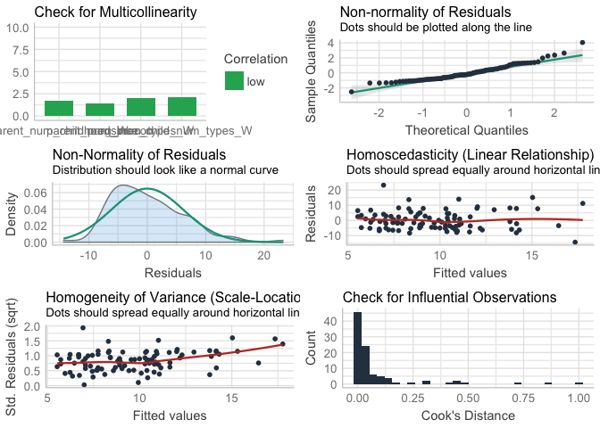<!-- -->

``` r
model_performance(lm.1)
```

    ## # Indices of model performance
    ## 
    ## AIC     |     BIC |    R2 | R2 (adj.) |  RMSE | Sigma
    ## -----------------------------------------------------
    ## 632.543 | 647.929 | 0.166 |     0.129 | 6.129 | 6.295

``` r
model_parameters(lm.1)
```

    ## Parameter               | Coefficient |   SE |        95% CI | t(91) |      p
    ## -----------------------------------------------------------------------------
    ## (Intercept)             |        6.19 | 1.12 | [ 3.96, 8.41] |  5.53 | < .001
    ## parent_num_childhood_W  |       -0.23 | 0.25 | [-0.74, 0.27] | -0.92 | 0.361 
    ## parent_num_precon       |        0.74 | 0.29 | [ 0.16, 1.32] |  2.53 | 0.013 
    ## preg_num_types_W        |        0.13 | 0.54 | [-0.95, 1.21] |  0.24 | 0.810 
    ## since_child_num_types_W |        0.74 | 0.36 | [ 0.03, 1.45] |  2.06 | 0.042

``` r
model_parameters(lm.1, standardize = "refit")
```

    ## Parameter               | Coefficient |   SE |        95% CI |    t(91) |      p
    ## --------------------------------------------------------------------------------
    ## (Intercept)             |    3.96e-17 | 0.10 | [-0.19, 0.19] | 4.16e-16 | > .999
    ## parent_num_childhood_W  |       -0.11 | 0.12 | [-0.36, 0.13] |    -0.92 | 0.361 
    ## parent_num_precon       |        0.29 | 0.11 | [ 0.06, 0.52] |     2.53 | 0.013 
    ## preg_num_types_W        |        0.03 | 0.14 | [-0.24, 0.31] |     0.24 | 0.810 
    ## since_child_num_types_W |        0.29 | 0.14 | [ 0.01, 0.57] |     2.06 | 0.042

### BAI

#### BAI Spearman’s correlation

``` r
SpearmanRho(df$parent_num_childhood_W, df$bai_total_W, use = "complete.obs", conf.level = .95)
```

    ##       rho    lwr.ci    upr.ci 
    ## 0.3552291 0.1666087 0.5187691

``` r
SpearmanRho(df$parent_num_precon, df$bai_total_W, use = "complete.obs", conf.level = .95)
```

    ##        rho     lwr.ci     upr.ci 
    ## 0.23056813 0.03154015 0.41200869

``` r
SpearmanRho(df$preg_num_types_W, df$bai_total_W, use = "complete.obs", conf.level = .95)
```

    ##       rho    lwr.ci    upr.ci 
    ## 0.2280667 0.0289023 0.4098142

``` r
SpearmanRho(df$since_child_num_types_W, df$bai_total_W, use = "complete.obs", conf.level = .95)
```

    ##        rho     lwr.ci     upr.ci 
    ## 0.28969997 0.09471516 0.46327835

#### Bayes Factors

``` r
childhood_bai <- correlationBF(df$parent_num_childhood_W, df$bai_total_W)
```

    ## Ignored 1 rows containing missing observations.

``` r
childhood_bai<- describe_posterior(childhood_bai, ci = 0.95)$BF

precon_bai <- correlationBF(df$parent_num_precon, df$bai_total_W)
```

    ## Ignored 1 rows containing missing observations.

``` r
precon_bai <- describe_posterior(precon_bai, ci = 0.95)$BF

preg_bai <- correlationBF(df$preg_num_types_W, df$bai_total_W)
```

    ## Ignored 1 rows containing missing observations.

``` r
preg_bai <- describe_posterior(preg_bai, ci = 0.95)$BF

since_bai <- correlationBF(df$since_child_num_types_W, df$bai_total_W)
```

    ## Ignored 1 rows containing missing observations.

``` r
since_bai <-describe_posterior(since_bai, ci = 0.95)$BF

mp_BFs <-
  mp_BFs %>% 
  cbind(
    BF_bai = c(
      childhood_bai,
      precon_bai,
      preg_bai,
      since_bai
    )
  )
```

#### Multiple regression

``` r
lm.2 <- lm(
 bai_total_W ~
    parent_num_childhood_W +
    parent_num_precon +
    preg_num_types_W +
    since_child_num_types_W,
  data = df
)
```

``` r
check_model(lm.2)
```

    ## `geom_smooth()` using formula 'y ~ x'
    ## `geom_smooth()` using formula 'y ~ x'

    ## `stat_bin()` using `bins = 30`. Pick better value with `binwidth`.

    ## Warning: Removed 96 rows containing missing values (geom_text_repel).

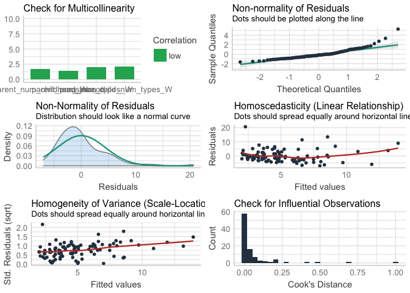<!-- -->

``` r
model_performance(lm.2)
```

    ## # Indices of model performance
    ## 
    ## AIC     |     BIC |    R2 | R2 (adj.) |  RMSE | Sigma
    ## -----------------------------------------------------
    ## 568.601 | 583.987 | 0.232 |     0.198 | 4.393 | 4.512

``` r
model_parameters(lm.2)
```

    ## Parameter               | Coefficient |   SE |        95% CI | t(91) |     p
    ## ----------------------------------------------------------------------------
    ## (Intercept)             |        2.02 | 0.80 | [ 0.42, 3.61] |  2.51 | 0.014
    ## parent_num_childhood_W  |        0.41 | 0.18 | [ 0.05, 0.77] |  2.25 | 0.027
    ## parent_num_precon       |        0.27 | 0.21 | [-0.15, 0.68] |  1.27 | 0.207
    ## preg_num_types_W        |        0.57 | 0.39 | [-0.20, 1.35] |  1.48 | 0.142
    ## since_child_num_types_W |        0.03 | 0.26 | [-0.48, 0.54] |  0.13 | 0.899

``` r
model_parameters(lm.2, standardize = "refit")
```

    ## Parameter               | Coefficient |   SE |        95% CI |     t(91) |      p
    ## ---------------------------------------------------------------------------------
    ## (Intercept)             |   -9.33e-17 | 0.09 | [-0.18, 0.18] | -1.02e-15 | > .999
    ## parent_num_childhood_W  |        0.27 | 0.12 | [ 0.03, 0.50] |      2.25 | 0.027 
    ## parent_num_precon       |        0.14 | 0.11 | [-0.08, 0.36] |      1.27 | 0.207 
    ## preg_num_types_W        |        0.20 | 0.13 | [-0.07, 0.46] |      1.48 | 0.142 
    ## since_child_num_types_W |        0.02 | 0.13 | [-0.25, 0.28] |      0.13 | 0.899

### BAI and CESD visualize associations

``` r
scales_apca_cesd_bai_x <- list(
  "Childhood adversity" = scale_x_continuous(
    breaks = seq.int(0, 14, 2)
  ),
  "Preconception adversity" = scale_x_continuous(
    breaks = seq.int(0, 10, 2)
  ),
  "Prenatal adversity"= scale_x_continuous(
    breaks = seq.int(0, 8, 1)
  ),
  "Adversity since birth" = scale_x_continuous(
    breaks = seq.int(0, 12, 2)
  )
)

scales_apca_cesd_bai_y <- list(
  "Depression" = scale_y_continuous(
    breaks = seq.int(0, 30, 5)
  ),
  "Anxiety" = scale_y_continuous(
    breaks = seq.int(0, 25, 5)
  )
)


mp_BFs_lf <-
  mp_BFs %>% 
  rename(
    Depression = BF_cesd,
    Anxiety = BF_bai
  ) %>% 
  pivot_longer(
    cols = -key
  ) %>% 
  rename(
    adversity_type = key,
    symptoms_type = name,
    BF = value
  )
```

``` r
df %>% 
  dplyr::select(
    Depression = cesd_total_W,
    Anxiety = bai_total_W,
    parent_num_childhood = parent_num_childhood_W,
    parent_num_precon,
    preg_num_types = preg_num_types_W,
    since_child_num_types = since_child_num_types_W
  ) %>% 
  pivot_longer(
    cols = parent_num_childhood:since_child_num_types,
    names_to = "adversity_type",
    values_to = "adversity_score"
  ) %>% 
  pivot_longer(
    cols = Depression:Anxiety,
    names_to = "symptoms_type",
    values_to = "symptoms_score"
  ) %>%
  left_join(mp_BFs_lf, by = c("adversity_type", "symptoms_type")) %>% 
  mutate(
    adversity_type = factor(
      adversity_type,
      levels = c(
        "parent_num_childhood",
        "parent_num_precon",
        "preg_num_types",
        "since_child_num_types"
      ),
      labels = c(
        "Childhood adversity",
        "Preconception adversity",
        "Prenatal adversity",
        "Adversity since birth"
      )
    ),
    BF_logic = case_when(
      BF > .33 & BF < 1 ~ "Anecdotal",
      BF >= 1 & BF < 3 ~ "Anecdotal",
      BF >= 3 & BF < 10 ~ "Moderate",
      BF >= 10 & BF < 30 ~ "Strong",
      BF >= 30 & BF < 100 ~ "Very strong",
      BF >= 100 ~ "Extreme"
    ),
    BF_logic = factor(
      BF_logic,
      levels = c("Anecdotal", "Moderate", "Strong", "Very strong", "Extreme")
    )
  ) %>% 
  ggplot(aes(adversity_score, symptoms_score)) +
  geom_jitter2(size = 4, alpha = 1/2, color = "black") +
  geom_smooth(
    method = "lm", 
    size = 4, 
    se = FALSE,
    aes(color = BF_logic)
  ) +
  scale_y_continuous(breaks = seq.int(0, 40, 5)) +
  scale_x_continuous(breaks = seq.int(0, 15, 1)) +
  scale_color_brewer(
    palette = "Oranges"
  ) +
  theme_grey() +
  theme(
    panel.grid = element_blank(),
    plot.title = element_text(size = 18, hjust = .5, face = "bold"),
    axis.title = element_text(size = 20),
    axis.text = element_text(size = 18),
    legend.title = element_text(size = 20), 
    legend.text = element_text(size = 18),
    strip.text.x = element_text(size = 16, face = "bold", color = "black"),
    strip.text.y = element_text(size = 20, face = "bold", color = "black"),
    strip.background = element_blank(),
    legend.position = "right"
  ) +
  labs(
    color = "Bayes Factor\n(Strength of evidence)",
    x = NULL,
    y = "Maternal symptoms"
  ) +
  facet_grid_sc(
    symptoms_type ~ adversity_type,
    scales = list(x = scales_apca_cesd_bai_x)
  )
```

    ## `geom_smooth()` using formula 'y ~ x'

    ## Warning: Removed 8 rows containing non-finite values (stat_smooth).

    ## Warning: Removed 8 rows containing missing values (geom_point).

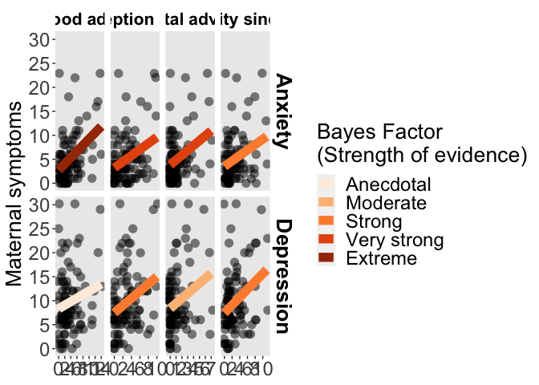<!-- -->

``` r
ggsave(
  "~/Box/lucy_king_files/MoD/APCA/figures/cesd_bai_adversity.png",
  dpi = 1000,
  height = 6,
  width = 14.75
)
```

    ## `geom_smooth()` using formula 'y ~ x'

    ## Warning: Removed 8 rows containing non-finite values (stat_smooth).
    
    ## Warning: Removed 8 rows containing missing values (geom_point).

## Comparative convergent validity

### CTQ \~ CESD

``` r
cor.test(df$ctq_total_W, df$cesd_total_W)
```

    ## 
    ##  Pearson's product-moment correlation
    ## 
    ## data:  df$ctq_total_W and df$cesd_total_W
    ## t = 1.1505, df = 94, p-value = 0.2529
    ## alternative hypothesis: true correlation is not equal to 0
    ## 95 percent confidence interval:
    ##  -0.08464838  0.31097656
    ## sample estimates:
    ##       cor 
    ## 0.1178374

``` r
ctq_cesd<- correlationBF(df$ctq_total_W, df$cesd_total_W)
```

    ## Ignored 1 rows containing missing observations.

``` r
describe_posterior(ctq_cesd, ci = 0.95)$BF
```

    ## [1] 0.4351361

### Life events measured in pregnancy \~ CESD

``` r
SpearmanRho(df$prenatal_life_events_W, df$cesd_total_W, use = "complete.obs", conf.level = .95)
```

    ##         rho      lwr.ci      upr.ci 
    ##  0.09415612 -0.12680016  0.30621017

``` r
ple_cesd<- correlationBF(df$prenatal_life_events_W, df$cesd_total_W)
```

    ## Ignored 16 rows containing missing observations.

``` r
describe_posterior(ple_cesd, ci = 0.95)$BF
```

    ## [1] 0.3297063

### CTQ \~ BAI

``` r
cor.test(df$ctq_total_W, df$bai_total_W)
```

    ## 
    ##  Pearson's product-moment correlation
    ## 
    ## data:  df$ctq_total_W and df$bai_total_W
    ## t = 2.9938, df = 94, p-value = 0.00352
    ## alternative hypothesis: true correlation is not equal to 0
    ## 95 percent confidence interval:
    ##  0.1005025 0.4678549
    ## sample estimates:
    ##       cor 
    ## 0.2950435

``` r
ctq_bai<- correlationBF(df$ctq_total_W, df$bai_total_W)
```

    ## Ignored 1 rows containing missing observations.

``` r
describe_posterior(ctq_bai, ci = 0.95)$BF
```

    ## [1] 13.16627

### Life events measured in pregnancy \~ BAI

``` r
SpearmanRho(df$prenatal_life_events_W, df$bai_total_W, use = "complete.obs", conf.level = .95)
```

    ##         rho      lwr.ci      upr.ci 
    ## 0.223958638 0.005897636 0.421687026

``` r
ple_bai <- correlationBF(df$prenatal_life_events_W, df$bai_total_W)
```

    ## Ignored 16 rows containing missing observations.

``` r
describe_posterior(ple_bai, ci = 0.95)$BF
```

    ## [1] 0.7699151

### CBCL

#### Spearman’s correlations

``` r
# maternal exposure
SpearmanRho(df$parent_num_types, df$total_problems_total, use = "complete.obs", conf.level = .95)
```

    ##       rho    lwr.ci    upr.ci 
    ## 0.3647145 0.1771843 0.5266889

``` r
SpearmanRho(df$parent_num_childhood_W, df$total_problems_total, use = "complete.obs", conf.level = .95)
```

    ##        rho     lwr.ci     upr.ci 
    ## 0.26715870 0.07044595 0.44387026

``` r
SpearmanRho(df$parent_num_precon, df$total_problems_total, use = "complete.obs", conf.level = .95)
```

    ##          rho       lwr.ci       upr.ci 
    ##  0.191961575 -0.008865566  0.377903671

``` r
SpearmanRho(df$preg_num_types_W, df$total_problems_total, use = "complete.obs", conf.level = .95)
```

    ##        rho     lwr.ci     upr.ci 
    ## 0.23805991 0.03945716 0.41856855

``` r
SpearmanRho(df$since_child_num_types_W, df$total_problems_total, use = "complete.obs", conf.level = .95)
```

    ##        rho     lwr.ci     upr.ci 
    ## 0.21272090 0.01277999 0.39630539

``` r
# child witnessing and exposure
SpearmanRho(df$child_num_wit_types_W, df$total_problems_total, use = "complete.obs", conf.level = .95)
```

    ##          rho       lwr.ci       upr.ci 
    ##  0.192774148 -0.008021828  0.378626735

``` r
SpearmanRho(df$child_num_dir_types_W, df$total_problems_total, use = "complete.obs", conf.level = .95)
```

    ##       rho    lwr.ci    upr.ci 
    ## 0.2987585 0.1045338 0.4710311

#### Bayes Factors

``` r
childhood_cbcl <- correlationBF(df$parent_num_childhood_W, df$total_problems_total)
```

    ## Ignored 1 rows containing missing observations.

``` r
childhood_cbcl <- describe_posterior(childhood_cbcl, ci = 0.95)$BF

precon_cbcl  <- correlationBF(df$parent_num_precon, df$total_problems_total)
```

    ## Ignored 1 rows containing missing observations.

``` r
precon_cbcl  <- describe_posterior(precon_cbcl, ci = 0.95)$BF

preg_cbcl  <- correlationBF(df$preg_num_types_W, df$total_problems_total)
```

    ## Ignored 1 rows containing missing observations.

``` r
preg_cbcl <- describe_posterior(preg_cbcl, ci = 0.95)$BF

since_cbcl  <- correlationBF(df$since_child_num_types_W, df$total_problems_total)
```

    ## Ignored 1 rows containing missing observations.

``` r
since_cbcl  <-describe_posterior(since_cbcl, ci = 0.95)$BF

wit_cbcl  <- correlationBF(df$child_num_wit_types_W, df$total_problems_total)
```

    ## Ignored 1 rows containing missing observations.

``` r
wit_cbcl  <-describe_posterior(wit_cbcl, ci = 0.95)$BF

dir_cbcl  <- correlationBF(df$child_num_dir_types_W, df$total_problems_total)
```

    ## Ignored 1 rows containing missing observations.

``` r
dir_cbcl  <-describe_posterior(dir_cbcl, ci = 0.95)$BF

cp_BFs <-
  tibble(
    key = c(
      "parent_num_childhood",
      "parent_num_precon",
      "preg_num_types",
      "since_child_num_types",
      "child_num_wit_types",
      "child_num_dir_types"
    ),
    BF_cbcl= c(
      childhood_cbcl,
      precon_cbcl,
      preg_cbcl,
      since_cbcl,
      wit_cbcl,
      dir_cbcl
    )
  )

cp_BFs
```

    ## # A tibble: 6 x 2
    ##   key                    BF_cbcl
    ##   <chr>                    <dbl>
    ## 1 parent_num_childhood     1.33 
    ## 2 parent_num_precon        0.655
    ## 3 preg_num_types         151.   
    ## 4 since_child_num_types    5.67 
    ## 5 child_num_wit_types      8.24 
    ## 6 child_num_dir_types   1511.

### CBCL visualize

``` r
scales_apca_child_probs <- list(
  `Maternal cumulative adversity` = scale_x_continuous(
    breaks = seq.int(0, 25, 5)
  ),
  `Child direct adversity` = scale_x_continuous(
    breaks = seq.int(0, 4, 1)
  )
)

df %>% 
  dplyr::select(
    total_problems_total,
    `Maternal cumulative adversity` = parent_num_types,
    `Child direct adversity` = child_num_dir_types
  ) %>% 
  pivot_longer(
    cols = `Maternal cumulative adversity`:`Child direct adversity`
  ) %>% 
  mutate(
    name = factor(
      name,
      levels = c(
        "Maternal cumulative adversity",
        "Child direct adversity"
      )
    )
  ) %>% 
  ggplot(aes(value, total_problems_total)) +
  geom_jitter2(size = 5, alpha = 1/3) +
  geom_smooth(method = "glm", size = 3, color = "black", se = FALSE) +
  scale_y_continuous(breaks = seq.int(0, 70, 10)) +
  scale_x_continuous(breaks = seq.int(0, 25, 1)) +
  theme_mod +
  labs(
    x = "APCA score",
    y = "Child total behavioral\nand emotional problems"
  ) +
  facet_grid_sc(.~name, scales = list(x = scales_apca_child_probs))
```

    ## `geom_smooth()` using formula 'y ~ x'

    ## Warning: Removed 2 rows containing non-finite values (stat_smooth).

    ## Warning: Removed 2 rows containing missing values (geom_point).

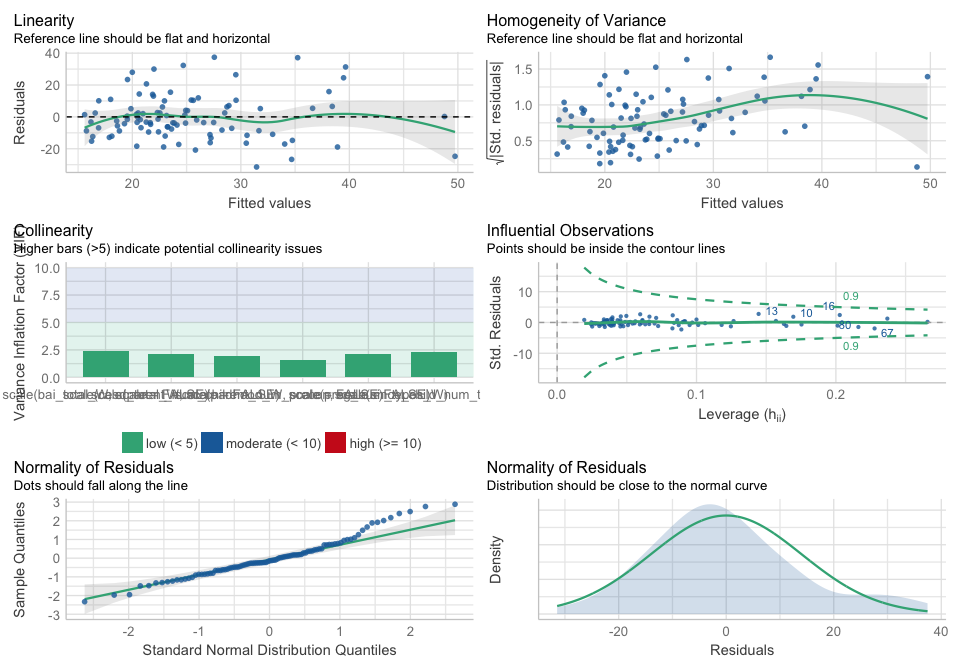<!-- -->

``` r
ggsave(
  "~/Box/lucy_king_files/MoD/APCA/figures/cbcl_apca_scores.png",
  dpi = 500,
  height = 5,
  width = 11
)
```

    ## `geom_smooth()` using formula 'y ~ x'

    ## Warning: Removed 2 rows containing non-finite values (stat_smooth).
    
    ## Warning: Removed 2 rows containing missing values (geom_point).

### CBCL total problems regressions

### Fit model

``` r
lm.4 <- lm(
  total_problems_total ~ 
    scale(cesd_total, scale = FALSE) +
    scale(bai_total, scale = FALSE),
  data = df
)

lm.5 <- lm(
  total_problems_total ~ 
    scale(cesd_total, scale = FALSE) +
    scale(bai_total, scale = FALSE) +
    scale(parent_num_childhood_W, scale = FALSE) +
    scale(parent_num_precon, scale = FALSE) +
    scale(preg_num_types_W) +
    scale(since_child_num_types_W),
  data = df
)


lm.6 <- lm(
  total_problems_total ~ 
    scale(cesd_total, scale = FALSE) +
    scale(bai_total, scale = FALSE) +
    scale(child_num_dir_types_W) +
    scale(child_num_wit_types_W),
  data = df
)
```

### Diagnostics

``` r
check_model(lm.5)
```

    ## `geom_smooth()` using formula 'y ~ x'
    ## `geom_smooth()` using formula 'y ~ x'

    ## `stat_bin()` using `bins = 30`. Pick better value with `binwidth`.

    ## Warning: Removed 95 rows containing missing values (geom_text_repel).

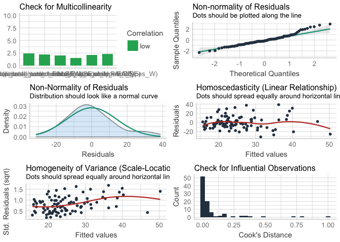<!-- -->

``` r
check_model(lm.6)
```

    ## `geom_smooth()` using formula 'y ~ x'

    ## `geom_smooth()` using formula 'y ~ x'

    ## `stat_bin()` using `bins = 30`. Pick better value with `binwidth`.

    ## Warning: Removed 95 rows containing missing values (geom_text_repel).

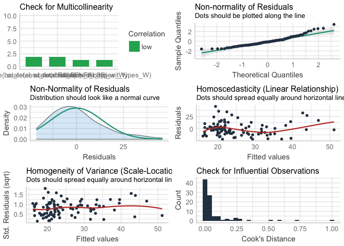<!-- -->

### Performance

``` r
lm.4_performance <- model_performance(lm.4)
lm.5_performance <- model_performance(lm.5)
lm.6_performance <- model_performance(lm.6)

# R-squared change for maternal adversity variables
lm.5_performance$R2_adjusted - lm.4_performance$R2
```

    ## [1] 0.04759148

``` r
# R-squared change for child adversity variables
lm.6_performance$R2_adjusted - lm.4_performance$R2
```

    ## [1] 0.1059644

### Parameters

``` r
model_parameters(lm.5) 
```

    ## Parameter               | Coefficient |   SE |         95% CI | t(88) |      p
    ## ------------------------------------------------------------------------------
    ## (Intercept)             |       25.11 | 1.50 | [22.14, 28.09] | 16.77 | < .001
    ## cesd_total              |        0.63 | 0.33 | [-0.02,  1.28] |  1.92 | 0.058 
    ## bai_total               |       -0.24 | 0.40 | [-1.03,  0.55] | -0.61 | 0.543 
    ## parent_num_childhood_W  |        0.46 | 0.64 | [-0.81,  1.74] |  0.72 | 0.474 
    ## parent_num_precon       |       -0.07 | 0.71 | [-1.48,  1.34] | -0.10 | 0.918 
    ## preg_num_types_W        |        5.55 | 2.19 | [ 1.20,  9.89] |  2.54 | 0.013 
    ## since_child_num_types_W |       -1.15 | 2.28 | [-5.69,  3.39] | -0.50 | 0.617

``` r
model_parameters(lm.5, standardize = "refit")
```

    ## Parameter               | Coefficient |   SE |        95% CI |     t(88) |      p
    ## ---------------------------------------------------------------------------------
    ## (Intercept)             |   -9.92e-17 | 0.10 | [-0.19, 0.19] | -1.04e-15 | > .999
    ## cesd_total              |        0.27 | 0.14 | [-0.01, 0.56] |      1.92 | 0.058 
    ## bai_total               |       -0.09 | 0.15 | [-0.39, 0.20] |     -0.61 | 0.543 
    ## parent_num_childhood_W  |        0.10 | 0.13 | [-0.17, 0.36] |      0.72 | 0.474 
    ## parent_num_precon       |       -0.01 | 0.12 | [-0.25, 0.22] |     -0.10 | 0.918 
    ## preg_num_types_W        |        0.36 | 0.14 | [ 0.08, 0.63] |      2.54 | 0.013 
    ## since_child_num_types_W |       -0.07 | 0.15 | [-0.36, 0.22] |     -0.50 | 0.617

``` r
model_parameters(lm.6) 
```

    ## Parameter             | Coefficient |   SE |         95% CI | t(90) |      p
    ## ----------------------------------------------------------------------------
    ## (Intercept)           |       25.12 | 1.45 | [22.25, 27.99] | 17.38 | < .001
    ## cesd_total            |        0.45 | 0.29 | [-0.13,  1.03] |  1.53 | 0.128 
    ## bai_total             |        0.04 | 0.34 | [-0.64,  0.72] |  0.12 | 0.906 
    ## child_num_dir_types_W |        5.07 | 1.67 | [ 1.76,  8.39] |  3.04 | 0.003 
    ## child_num_wit_types_W |        1.64 | 1.64 | [-1.61,  4.90] |  1.00 | 0.318

``` r
model_parameters(lm.6, standardize = "refit")
```

    ## Parameter             | Coefficient |   SE |        95% CI |     t(90) |      p
    ## -------------------------------------------------------------------------------
    ## (Intercept)           |   -1.30e-16 | 0.09 | [-0.18, 0.18] | -1.41e-15 | > .999
    ## cesd_total            |        0.20 | 0.13 | [-0.06, 0.45] |      1.53 | 0.128 
    ## bai_total             |        0.02 | 0.13 | [-0.24, 0.27] |      0.12 | 0.906 
    ## child_num_dir_types_W |        0.33 | 0.11 | [ 0.11, 0.54] |      3.04 | 0.003 
    ## child_num_wit_types_W |        0.11 | 0.11 | [-0.10, 0.31] |      1.00 | 0.318
